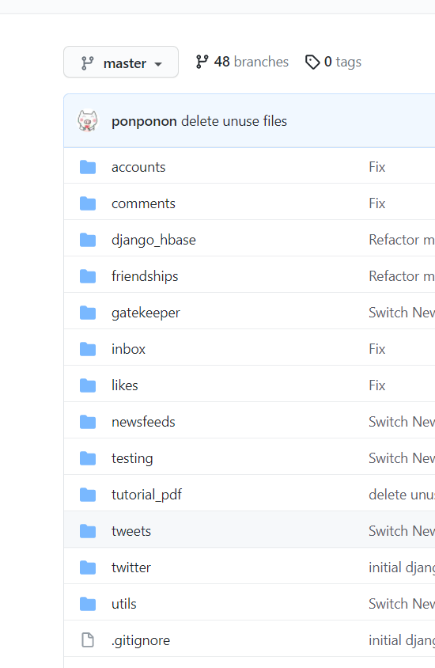
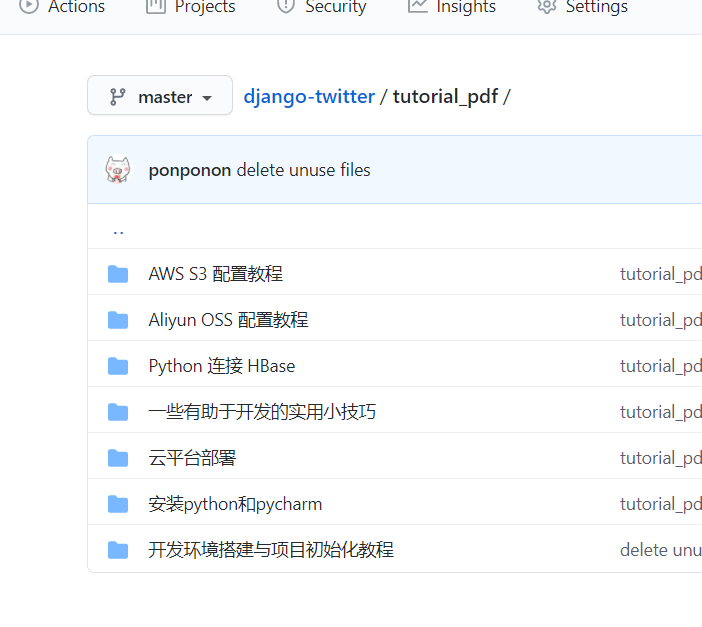

在同学们跟着《开发环境搭建与项目初始化教程》配置开发环境的时候，我们会将同学们常犯的、有价值的错误实时更新到教程中，为了同学们能够更好的获取新版本的教程和知道教程修改了哪些方面的内容，我们将该课程中有可能会用到的所有的课件也一起放到我们官方的 Repo 中（https://github.com/jiuzhangsuanfa-org/django-twitter）。

所有的教程都在 master 分支的 [tutorial_pdf](https://github.com/jiuzhangsuanfa-org/django-twitter/tree/master/tutorial_pdf) 文件夹中，同学们可以在每次使用教程前都执行一下 `git pull` 命令获取到最新的教程版本。

> 记得切换到 master 分支哦
> 
> 
> md 记得用 typora 打开，下载地址：https://typora.io/

