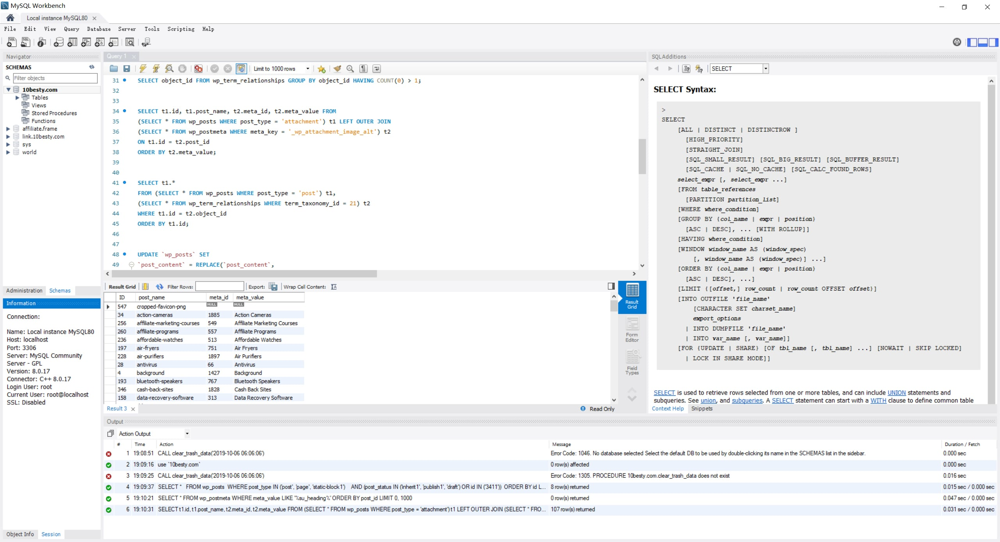
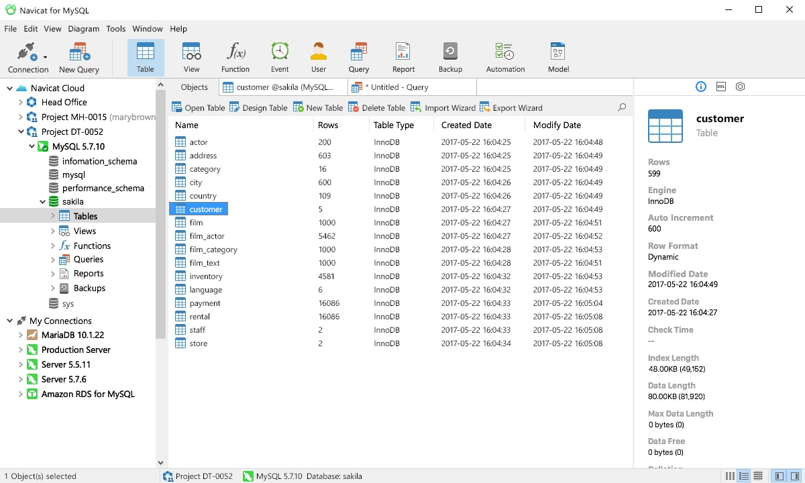
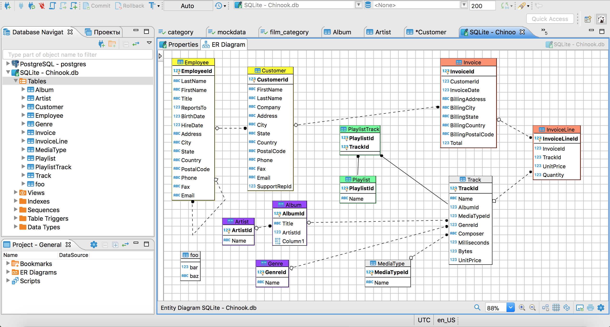
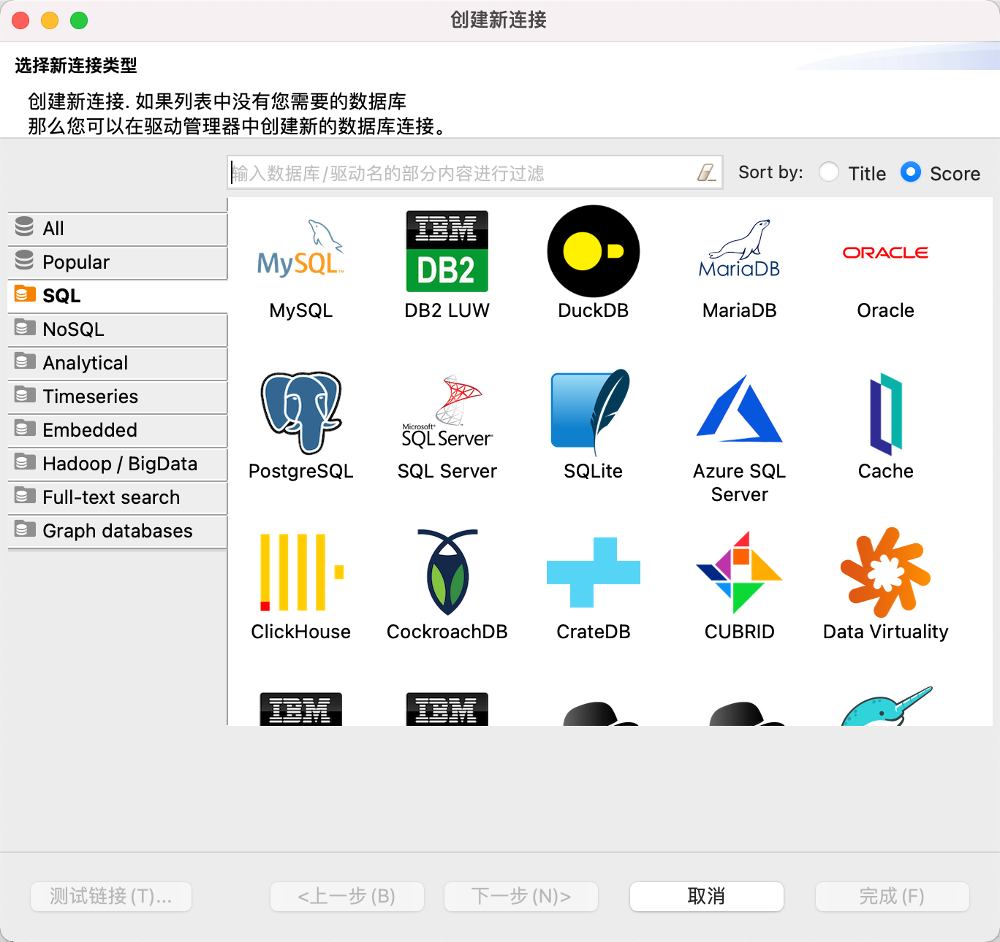
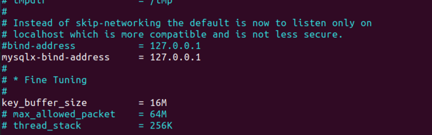
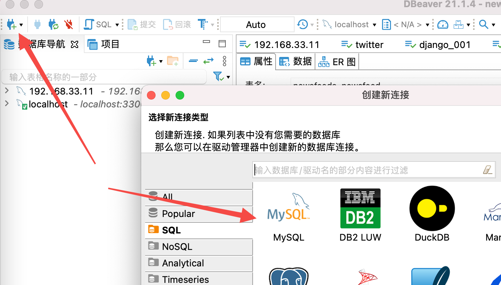
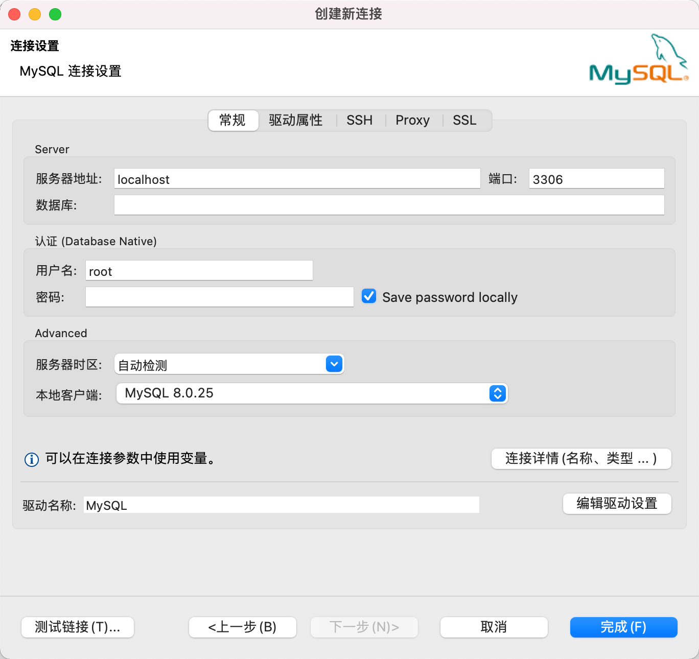

# 远程连接 Mysql 数据库

因为我们的 Mysql 是运行在虚拟机中，而虚拟机不提供可视化的界面，这个时候要查询数据库中的数据就需要频繁的使用 mysql 客户端命令去执行相关的命令：

```bash
vagrant@vagrant:~$ mysql -u root -p
Enter password: 
Welcome to the MySQL monitor.  Commands end with ; or \g.
Your MySQL connection id is 29
Server version: 8.0.25 MySQL Community Server - GPL

Copyright (c) 2000, 2021, Oracle and/or its affiliates.

Oracle is a registered trademark of Oracle Corporation and/or its
affiliates. Other names may be trademarks of their respective
owners.

Type 'help;' or '\h' for help. Type '\c' to clear the current input statement.

mysql> 
mysql> 

```

对于一些频繁的操作经常需要输入命令会带来一些不方便，又因为虚拟机不带图形界面无法直接安装可视化客户端，所以这个时候我们就执行通过安装在宿主机上的可视化客户端来访问虚拟机中的 Mysql 了。


## 下载一个 Mysql 可视化客户端

在下载之前，先来了解一下市面上常见的可视化客户端，了解他们之间的异同点：

### 常见的可视化客户端

关于  Mysql  的可视化客户端的选择有多种多样：

- #### MySQL Workbench

  

  [MySQL Workbench](https://www.mysql.com/products/workbench/)是面向开发人员、数据库架构师和[DBA（数据库管理员）](https://baike.baidu.com/item/数据库管理员/1216449)的统一可视化工具，提供了用于设计、开发和管理数据库的各种功能。目前有3个版本可用：[社区版](https://www.mysql.com/products/community/)、[标准版](https://www.mysql.com/products/standard/)和[企业版](https://www.mysql.com/products/enterprise/)，社区版是免费的开源版本，提供一些基本功能，另外两个是具有扩展功能的商业版本。

- #### Navicat for MySQL

  

  [Navicat for MySQL](https://www.navicat.com/products/navicat-for-mysql)是数据库开发人员和管理人员的一组有用工具，与MySQL、[MariaDB](https://mariadb.org/)和云数据库兼容。丰富的功能集使你能够简化数据库开发过程，并在执行各种管理任务时提高工作效率。这个客户端提供3个付费版本，并提供14天的全功能免费试用，以便让你评估它是否适合自己。

- #### DBeaver Community

  
  
  **DBeaver**是一个SQL客户端和数据库管理工具。对于[关系数据库](https://zh.wikipedia.org/wiki/关系数据库)，它使用[JDBC](https://zh.wikipedia.org/wiki/Java数据库连接) API通过JDBC驱动程序与数据库交互。对于其他数据库（[NoSQL](https://zh.wikipedia.org/wiki/NoSQL)），它使用专有数据库驱动程序。它提供了一个编辑器，支持[代码完成](https://zh.wikipedia.org/wiki/自动完成)和[语法高亮](https://zh.wikipedia.org/wiki/語法突顯)。它提供了一种插件体系结构（基于[Eclipse](https://zh.wikipedia.org/wiki/Eclipse)插件体系结构），允许用户修改应用程序的大部分行为，以提供与数据库无关的针对数据库的功能或特性。这是一个用[Java](https://zh.wikipedia.org/wiki/Java平臺)编写的基于Eclipse平台的桌面应用程序。
  
  DBeaver的社区版是一个[自由及开放源代码软件](https://zh.wikipedia.org/wiki/自由及开放源代码软件)，在[Apache许可证](https://zh.wikipedia.org/wiki/Apache许可证)下分发。DBeaver的闭源企业版是在商业许可下分发的。


### 选择开源且稳定 DBeaver 😍


DBeaver 是其中的佼佼者，首先因为开源免费。

DBeaver 的社区版提供了对绝大多数 SQL 数据库的支持，且功能非常的强大：

- 开源免费
- 功能非常强大且齐全
- 支持几乎所有的 SQL 数据库
- 长得好看
- 多平台支持：Linux、windows、Mac
- 持续更新：每两周更新一次




下载链接：https://dbeaver.io/

下载后并安装它吧！

但是要链接远程 Mysql ，我们还需要完成下面步骤👇

## 创建一个可以被远程访问的 Mysql 账户

>  参考文章：[ubuntu20 安装和配置mysql8.0.23](https://segmentfault.com/a/1190000039203507)


首先让我们来了解一下 Mysql 的用户表：

```bash
mysql> use mysql
mysql> select host,user,authentication_string from user;
+-----------+------------------+------------------------------------------------------------------------+
| host      | user             | authentication_string                                                  |
+-----------+------------------+------------------------------------------------------------------------+
| localhost | debian-sys-maint | $A$005$)h&}?mq<1rx*2^ut5na8v15kXP0XBBiK63RFLJBF2vHY0DYnmVHNA/PoHA |
| localhost | mysql.infoschema | $A$005$THISISACOMBINATIONOFINVALIDSALTANDPASSWORDTHATMUSTNEVERBRBEUSED |
| localhost | mysql.session    | $A$005$THISISACOMBINATIONOFINVALIDSALTANDPASSWORDTHATMUSTNEVERBRBEUSED |
| localhost | mysql.sys        | $A$005$THISISACOMBINATIONOFINVALIDSALTANDPASSWORDTHATMUSTNEVERBRBEUSED |
| localhost | root             | *96E7A848AB10957950D4E01EE8D60E361205A073                              |
+-----------+------------------+------------------------------------------------------------------------+
6 rows in set (0.00 sec)
```

从上面的表格中可以看到 root 用户的 host 是 localhost，这表示本机

我们需要增加这样一条记录 `| % | root             | *96E7A848AB10957950D4E01EE8D60E361205A073      `

使得最后的结果变成这样：

```
+-----------+------------------+------------------------------------------------------------------------+
| host      | user             | authentication_string                                                  |
+-----------+------------------+------------------------------------------------------------------------+
| localhost | debian-sys-maint | $A$005$)h&}?mq<1rx*2^ut5na8v15kXP0XBBiK63RFLJBF2vHY0DYnmVHNA/PoHA |
| localhost | mysql.infoschema | $A$005$THISISACOMBINATIONOFINVALIDSALTANDPASSWORDTHATMUSTNEVERBRBEUSED |
| localhost | mysql.session    | $A$005$THISISACOMBINATIONOFINVALIDSALTANDPASSWORDTHATMUSTNEVERBRBEUSED |
| localhost | mysql.sys        | $A$005$THISISACOMBINATIONOFINVALIDSALTANDPASSWORDTHATMUSTNEVERBRBEUSED |
| localhost | root             | *96E7A848AB10957950D4E01EE8D60E361205A073                              |
| %         | root             | *96E7A848AB10957950D4E01EE8D60E361205A073xxxxx                         |
+-----------+------------------+------------------------------------------------------------------------+
6 rows in set (0.00 sec)
```

为什么有两个root？为什么一个是localhost，为什么一个是%呢？

不要感到奇怪，这是 Mysql 的用户管理机制。

localhost  root 表示从本机登录 root 账号

% root 表示从远程登录账号，不包括本机

这种同一个用户可以设置两种 host 的方式为我们提供了更安全的防护，你可以把 localhost 的密码设置的超级简单，把 % root 的密码设置的超级复杂，这样自己本机登录的时候就很方便；黑客想黑进来的时候就很不方便。

> 有些教程会说 % 表示所有主机，包括本机。这种错误的，只设置 % root  不设置 localhost root，结果就是本地无法登陆 mysql


接下来就是动手环节了，先登录到 Mysql

```bash
mysql -u root -p"yourpassword"
```

然后输入以下命令：

**新建一个 host 为 % 的 root用户，密码随意**

```sql
create user 'root'@'%' identified by 'yourpassword';
```

**授权**

```plaintext
GRANT ALL PRIVILEGES ON *.* TO 'root'@'%' WITH GRANT OPTION;
```

**刷新权限**

```abnf
FLUSH PRIVILEGES;
```

通过如下的方式查看我们的用户信息情况:

```bash
mysql> use mysql
mysql> select host,user,authentication_string from user;
+-----------+------------------+------------------------------------------------------------------------+
| host      | user             | authentication_string                                                  |
+-----------+------------------+------------------------------------------------------------------------+
| %         | root             | *96E7A848AB10957950D4E01EE8D60E361205A073                              |
| localhost | debian-sys-maint | $A$005$)h&}?mq<1rx*2^ut5na8v15kXP0XBBiK63RFLJBF2vHY0DYnmVHNA/PoHA |
| localhost | mysql.infoschema | $A$005$THISISACOMBINATIONOFINVALIDSALTANDPASSWORDTHATMUSTNEVERBRBEUSED |
| localhost | mysql.session    | $A$005$THISISACOMBINATIONOFINVALIDSALTANDPASSWORDTHATMUSTNEVERBRBEUSED |
| localhost | mysql.sys        | $A$005$THISISACOMBINATIONOFINVALIDSALTANDPASSWORDTHATMUSTNEVERBRBEUSED |
| localhost | root             | *96E7A848AB10957950D4E01EE8D60E361205A073                              |
+-----------+------------------+------------------------------------------------------------------------+
6 rows in set (0.00 sec)
```


## 让 Mysql 监听所有主机

光设置需要登陆用户的 host 为 % 是不够的，因为 mysql 的配置文件中静止了远程登录，需要去修改一下配置文件。
👇👇👇

先关停mysql服务

```arduino
sudo systemctl stop mysql
```

编辑mysql配置文件

```awk
sudo vim /etc/mysql/mysql.conf.d/mysqld.cnf
```




注销掉

```1c
#bind-address           = 127.0.0.1
```

在开启mysql服务即可`sudo service mysql start`

```bash
bot@ubuntu:~$ sudo service mysql start
bot@ubuntu:~$ sudo service mysql status
● mysql.service - MySQL Community Server
     Loaded: loaded (/lib/systemd/system/mysql.service; enabled; vendor preset: enabled)
     Active: active (running) since Wed 2021-02-10 21:05:54 CST; 10s ago
    Process: 4013 ExecStartPre=/usr/share/mysql/mysql-systemd-start pre (code=exited, status=0/SU>
   Main PID: 4021 (mysqld)
     Status: "Server is operational"
      Tasks: 38 (limit: 4619)
     Memory: 334.7M
     CGroup: /system.slice/mysql.service
             └─4021 /usr/sbin/mysqld

2月 10 21:05:54 ubuntu systemd[1]: Starting MySQL Community Server...
2月 10 21:05:54 ubuntu systemd[1]: Started MySQL Community Server.
```

此时，既可以本地（直接物理机的`终端`上，或者`ssh`连接至物理机），又可以远程（通过`dataGrip`、`navicat`这些软件）


# 使用可视化客户端连接远程 mysql 服务器

步骤一：点击左上角的插头，选择Mysql



步骤二：天下服务器地址、用户名、密码这三个信息就好了

服务器地址默认是 `192.168.33.10`，如果你自行修改过，请在虚拟机中使用 `ip a` 命令查看实际ip地址




# 一个增加版 Mysql 命令行客户端

目前市面上存在各种五花八门的图形界面客户端，如 phpmyadmin，navicat 以及官方的 MySQL Workbench 等等。而在日常工作或者使用中，通过命令连接 MySQL 还是更方便的，不过对于命令行爱好者或者对 MySQL 命令不熟悉的同学来说，如果只用官方提供的 client，其实体验还是比较差的，下面就给大家推荐一款绝佳的 MySQL 命令行客户端工具吧！


改软件使用 python 编写，所以可以直接通过 pip 来安装他

执行如下命令：

```bash
pip install mycli
```

> 注意，这种方式 mycli 会安装到 `/home/vagrant/.local/bin/` 路径中，可能需要将该目录添加到环境变量中。

也可以使用 `apt` 包管理器来安装 `mycli`

```bash
sudo apt install mycli
```

安装完成之后，可以使用如下命令登录虚拟机中的 mysql

```
mycli -u root -p"yourpassword"
```

可以看到，mycli 的使用方法完全兼容了原有的 mysql 客户端，无学习成本

> mycli 使用的 Unix-like 上使用，linux、mac都巨佳，但不适合 Windows ，因为会有字符编码问题
