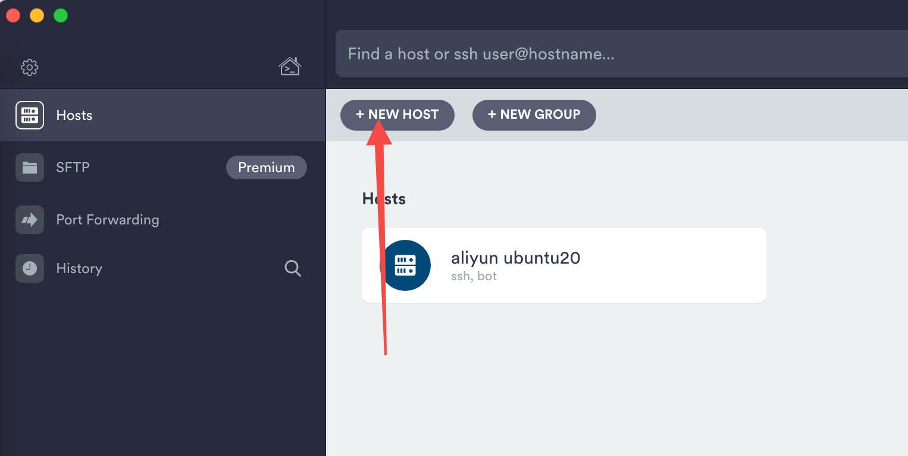
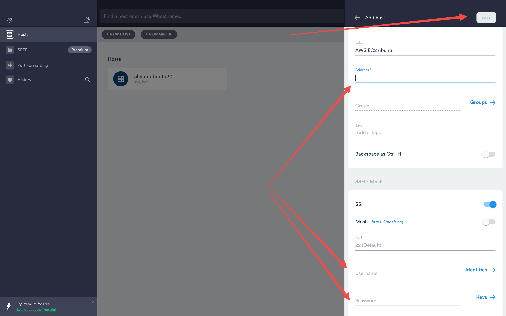
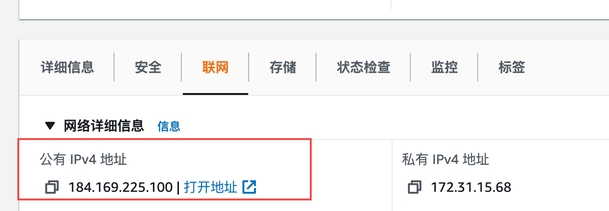
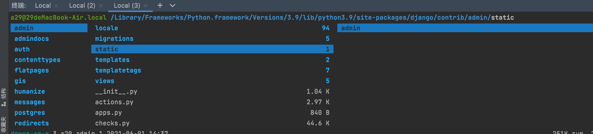

大家好，我们的课程已经接近尾声，这期教程是教大家如何将我们自己写的项目部署到云服务器上

教程包含以下内容：

- 购买 AWS EC2 云服务器
- 配置防火墙的入站策略
- 使用 SSH 客户端连接云服务器
- 克隆代码至云服务器
- 在云服务器中重建运行环境
- 使用Nginx+Gunicorn搭建生产环境

让我们一起来学习吧！


# 购买 AWS EC2 云服务器

> AWS EC2 提供了一些免费套餐，可以免费使用，如果你那里没有免费版本的话，可以花最少的钱买一个最便宜的

https://us-west-1.console.aws.amazon.com/ec2/v2/home?region=us-west-1#LaunchInstanceWizard:

## 步骤一：选择 ubuntu18.04

选择和我们开发环境相似的 Ubuntu18.04 发行版本


## 步骤二：选择一个免费套餐

如果有免费的就用免费的


点击`审核和启动`


点击 `启动`


生产密钥对

> 密钥对的名字可以随便取，这里以`django-twitter`为例子演示，别忘了下载 `django-twitter.pem` 文件


# 连接云服务器

https://us-west-1.console.aws.amazon.com/ec2/v2/home?region=us-west-1#Home:

此时你就可以在 EC2 的控制台看到`实例（正在运行） 1`


点击`实例（正在运行）`


点击实例ID列对应的 i-0e7xxxx


点击连接


选择 `SSH 客户端`

下载对应的 pem 文件

进入到 `django-twitter.pem` 存放该文件的路径中，输入命令 `chmod 400 django-twitter.pem  `修改文件的权限为 400 

> 该文件默认是644 ，是不安全的，所以要改成400，不然无法连接

```zsh
➜  Downloads ll | grep pem                                                                         
3004806 .r--------@     1 1.7k       8 a29  staff 22 7 10:42    django-twitter.pem
➜  Downloads chmod 400 django-twitter.pem  
```

在使用ssh命令连接云服务器,命令如下所示：

```bash
ssh -i "django-twitter.pem" ubuntu@ec2-184-169-225-100.us-west-1.compute.amazonaws.com
```

完整的样子：

```bash
➜  Downloads ssh -i "django-twitter.pem" ubuntu@ec2-184-169-225-100.us-west-1.compute.amazonaws.com
Welcome to Ubuntu 18.04.5 LTS (GNU/Linux 5.4.0-1045-aws x86_64)

 * Documentation:  https://help.ubuntu.com
 * Management:     https://landscape.canonical.com
 * Support:        https://ubuntu.com/advantage

  System information as of Thu Jul 22 05:57:37 UTC 2021

  System load:  0.0               Processes:           95
  Usage of /:   16.0% of 7.69GB   Users logged in:     0
  Memory usage: 20%               IP address for eth0: 172.31.15.68
  Swap usage:   0%


0 packages can be updated.
0 of these updates are security updates.

New release '20.04.2 LTS' available.
Run 'do-release-upgrade' to upgrade to it.


Last login: Thu Jul 22 05:49:04 2021 from 115.192.110.179
To run a command as administrator (user "root"), use "sudo <command>".
See "man sudo_root" for details.

ubuntu@ip-172-31-15-68:~$ 
```

> Linux 的命令提示符格式:  username@hostname 


## 修改密码

### 输入 sudo su转为root用户。 注意，必须先转为root用户！！！

```
sudo su
```

### sudo passwd user(user 是对应的用户名)

输入新密码，确认密码。

```
sudo passwd ubuntu
```

> 默认的用户名是 `ubuntu`

### 切回 ubuntu

```
su ubuntu
```

完整流程如下所示：

```bash
ubuntu@ip-172-31-15-68:~$ sudo su
root@ip-172-31-15-68:/home/ubuntu# sudo passwd ubuntu
Enter new UNIX password: 
Retype new UNIX password: 
passwd: password updated successfully
root@ip-172-31-15-68:/home/ubuntu# su ubuntu
ubuntu@ip-172-31-15-68:~$ 
```

最后重启云服务器，让设置生效

> 重启需要几分钟

## 设置 ssh 连接属性

重新登录云服务器

修改 /etc/ssh/sshd_config

```bash
sudo vim /etc/ssh/sshd_config
```

在sshd_config文件中 按enter键一直往下找，直到找到以下内容，若该行代码被#注释掉，先删除 # 。然后按下文提示修改相应yes/no

```bash
PubkeyAuthentication yes

PasswordAuthentication yes
```

重启ssh服务

```bash
sudo service sshd restart
```

## 搭建开发环境

https://www.jiuzhang.com/course/89/

首先参考《开发环境搭建与项目初始化教程.md》在服务器重建运行环境

> 因为上云后没有了vagrant,所以需要我们自己执行 `provision.sh` 脚本
>
> 代码可以通过 ftp 工具上传到云服务器，也可以通过 git clone 到云服务器上


# 开放端口

## 步骤一：记住安全组名称


## 步骤二：编辑入站策略


## 步骤三：添加 80 端口和8000端口

> 80 端口是 HTTP 协议的端口
>
> 8000端口用作在服务器上调试我们的 Twitter 项目

修改前


修改后


> 不要忘了点击`保存规则`

# 克隆项目代码到本地

现在我们就可以将 Github 上的代码云服务器上 

## 步骤一：使用ssh客户端连接至云服务器

以 `termius` ssh客户端为例（ https://termius.com/）

> 你可以在mac的终端使用ssh命令来登录云服务器，但更建议用专业的ssh客户端

### 选择NEW HOST



### 填写地址、用户名和密码，再保存



地址可以通过下图获取，这个 `公有IPv4地址`就是公网ip，可以从外部网络访问我们的服务器，记住他哦，后米还要用到的



### 添加并继续


### 看到如下界面说明成功：


## 步骤二：找一个自己喜欢的位置克隆代码

> TIPS: 记得添加公钥哦

```bash
ubuntu@ip-172-31-15-68:~$ mkdir python
ubuntu@ip-172-31-15-68:~$ cd python
ubuntu@ip-172-31-15-68:~/python$ git clone https://github.com/yourself/twitter.git
Cloning into 'twitter'...
remote: Enumerating objects: 406, done.
remote: Counting objects: 100% (406/406), done.
remote: Compressing objects: 100% (400/400), done.
remote: Total 406 (delta 250), reused 0 (delta 0), pack-reused 0
Receiving objects: 100% (406/406), 59.50 KiB | 331.00 KiB/s, done.
Resolving deltas: 100% (250/250), done.
ubuntu@ip-172-31-15-68:~/python$ ll
total 12
drwxrwxr-x 3 ubuntu ubuntu 4096 Jul 27 01:41 ./
drwxr-xr-x 7 ubuntu ubuntu 4096 Jul 27 01:39 ../
drwxrwxr-x 6 ubuntu ubuntu 4096 Jul 27 01:42 twitter/
ubuntu@ip-172-31-15-68:~/python$ cd twitter/
```

> 我这里把项目名称取为 twitter，你那里可能是django-twitter，或者my-twitter等其他名字

依次输入以下的命令创建必要的组件

```bash
sudo apt install python3-pip
sudo ln -s /usr/bin/python3 /usr/bin/python
sudo ln -s /usr/bin/pip3 /usr/bin/pip
```

安装需要的第三方包和第三方组件(mysql memcached redis hbase)等等，在执行如下命令

```bash
echo 'export PATH="/home/ubuntu/.local/bin/:$PATH"' > ~/.bashrc
source ~/.bashrc
```

如果都装好了

就可以使用如下命令开启一个服务

```bash
python manage.py runserver 0.0.0.0:8000
```

> 记得把 settings.py 文件中的 ALLOWED_HOSTS 设为 ALLOWED_HOSTS = ['*']

打开你的本地浏览器，输入 ip+端口 访问

在我这里就是 `http://184.169.225.100:8000/`

看到如下界面说明访问成功


可以正常访问 DRF 的 api 接口


# 添加 Nginx 和 Gunicorn

还记得《第七章【互动】Web Framework 介绍及常用 Linux 和 Git 命令》介绍的服务器吗？


使用 `python manage.py runserver 0.0.0.0:8000` 开启的服务器虽然能用大，但是只够用于测试，出于性能、稳定性等考虑不会用于生产环境。

生产环境我们一半会用 Nginx、apache、tomact 加 Gnuicorn、uWSGI等方案

排列组合一下就有六种方案 

再次我们采用 Nginx+Gunicorn的方案，想要其他方案的小伙伴也可以自己去实现。


方案框架图：


开发时我们用的是 Django 自带的开发服务器，但那个性能太差了，不可能用到线上环境。所以线上部署时，我们不仅要安装 `Django`，还要安装 `Nginx` 和 `Gunicorn`，这三兄弟的工作流程如下：

- 客户端发来 http 请求，Nginx 作为直接对外的服务器接口，对 http 请求进行分析
- 如果是静态资源请求，则由Nginx自己处理（效率极高）
- 如果是动态资源请求，则把它转发给 Gunicorn（这个过程叫做反向代理）
- Gunicorn 对请求进行预处理后，转发给 Django，最终完成资源的返回

如果用餐馆来做比喻的话，Nginx 就是迎宾小姐，客人如果点了酒水，迎宾小姐自己就帮忙拿了；而 Gunicorn 是传菜员，Django 是厨师，他两一起满足客人对现炒美食的需求。


## 安装 Nginx

使用 apt 包管理器安装 nginx

```bash
sudo apt install nginx
```

查看 nginx 运行状态

```bash
service nginx status
```

可以看到如下的显示：

```bash
ubuntu@ip-172-31-15-68:~/python/twitter$ service nginx status
● nginx.service - A high performance web server and a reverse proxy server
   Loaded: loaded (/lib/systemd/system/nginx.service; enabled; vendor preset: enabled)
   Active: active (running) since Sun 2021-08-01 02:53:50 UTC; 5min ago
     Docs: man:nginx(8)
 Main PID: 9071 (nginx)
    Tasks: 2 (limit: 1140)
   CGroup: /system.slice/nginx.service
           ├─9071 nginx: master process /usr/sbin/nginx -g daemon on; master_process on;
           └─9075 nginx: worker process

Aug 01 02:53:50 ip-172-31-15-68 systemd[1]: Starting A high performance web server and a reverse proxy server...
Aug 01 02:53:50 ip-172-31-15-68 systemd[1]: nginx.service: Failed to parse PID from file /run/nginx.pid: Invalid argument
Aug 01 02:53:50 ip-172-31-15-68 systemd[1]: Started A high performance web server and a reverse proxy server.
ubuntu@ip-172-31-15-68:~/python/twitter$ 
```

看到`Active: active (running)` 就说明成功了！

此时你在浏览器直接输入你的云服务器的公网ip，就可以看到如下所示的界面


## 安装 Gunicorn

Gunicorn是一个使用纯Python编写的 WSGI Server，所以我们可以直接通过 pip 安装 Gunicorn

```bash
sudo pip install gunicorn
```

查看 gunicorn 的安装位置和版本

```bash
which gunicorn
gunicorn --version
```

可以看到如下的显示：

```bash
ubuntu@ip-172-31-15-68:~/python/twitter$ which gunicorn
/usr/local/bin/gunicorn
ubuntu@ip-172-31-15-68:~/python/twitter$ gunicorn --version
gunicorn (version 20.1.0)
```

## 配置Nginx

Nginx 的常用功能：

1. 正向代理
2. 反向代理  ✅
3. 透明代理
4. 负载均衡
5. 静态服务器 ✅

我们这些需要用到后面打勾的功能。


通过公网 IP 访问Nginx 欢迎界面出现了，神奇吧。但这个默认配置显然是不能用的，所以需要重新写 Nginx 的配置文件。进入 `/etc/nginx/sites-available` 目录，这里是定义 **Nginx 可用配置**的地方。输入指令 `sudo vim django-twitter.com` 创建配置文件并打开 

### 进入 `/etc/nginx/sites-available` 目录

```bash
cd /etc/nginx/sites-available
```

### 编辑 `django-twitter.com` 文件

```bash
sudo vim django-twitter.com
```

> 这个名字也可以换成你喜欢的其他名字，包括后缀 .com 也可以随意更改，没有限制

添加以下内容：

```
server {
  charset utf-8;
  listen 80;
  server_name 184.169.225.100;  # 改成你的 IP

  location /static {
    alias /home/ubuntu/python/twitter/static;
  }

  location /media {
    alias /home/ubuntu/python/twitter/media;
  }
  location / {
    proxy_set_header Host $host;
    proxy_pass http://unix:/tmp/184.169.225.100.socket;  # 改成你的 IP
  }
}
```

> 如果你已经申请好域名了，就把配置中有 IP 的地方都修改为域名，比如：server_name www.xxxx.com;
>
> 我这里把项目名称取为 twitter，你那里可能是django-twitter，或者my-twitter等其他名字，所以记得把`/home/ubuntu/python/twitter/static;` 中的 twitter 改为你自己的项目名称，django-twitter或者my-twitter等等

此配置会监听 80 端口（通常 http 请求的端口），监听的 IP 地址写你自己的**服务器公网 IP**。

配置中有3个规则：

- 如果请求 static 路径则由 Nginx 转发到目录中寻找静态资源，这被称为静态代理
- 如果请求 media 路径则由 Nginx 转发到目录中寻找媒体资源，这被称为静态代理
- 其他请求则交给 Django 处理

因为我们写的只是 Nginx 的**可用配置**，所以还需要把这个配置文件链接到**在用配置**上去：

```bash
sudo ln -s /etc/nginx/sites-available/django-twitter.com /etc/nginx/sites-enabled
```

并重启 Nginx

```bash
sudo service nginx reload
```

至此 Nginx 就配置好了，接下来去搞定 `Gunicorn` 吧。

> 有的读者无论怎么配置都只能看到 Nginx 欢迎页面，有可能是 sites-enabled 目录中的 default 文件覆盖了你写的配置。将 default 文件删掉就可以正常代理自己的配置文件了。

## 配置Gunicorn

进入项目路径:

```bash
cd ~/python/twitter
```

> 我这里把项目名称取为 twitter，你那里可能是django-twitter，或者my-twitter等其他名字，所以记得把`~/python/twitter` 中的 twitter 改为你自己的项目名称，django-twitter或者my-twitter等等

```bash
gunicorn --bind unix:/tmp/184.169.225.100.socket twitter.wsgi:application
```

> - 记得把 `184.169.225.100` 改成你自己的公网 IP 地址


## 访问项目

此时输入ip地址访问，就不在是之前的Nginx欢迎界面了，而是我们的项目的样子了。

> 好奇的你有没有注意到一点，我们以前都是通过 `python manage.py runserver` 命令跑项目的，现在我们完全没有用到这个命令哦。为什么呢？因为 `python manage.py runserver` 命令背后是启动了 Django 自带的一个简易 WSGI server，而现在我们使用 Gunicorn 这个专业的 WSGI server 替代了Django 自带的简易 WSGI server


> 注意：
>
> - 项目中不要包含 print 函数，会导致服务器异常
> - 现在是以 DEBUG=True 模式运行的，这被称为开发模式，如果想以生产模式运行的话，记得把 settings.py 中的DEBUG选项设为 False

但是目前还存在一个关于静态代理的问题：

什么是静态代理呢？就是自动处理诸如 js、css文件和jpg、png等图片

下面是有静态代理的样子，可以看到css、js等文件都200请求成功


下面是没有静态代理的样子，可以看到css、js等文件都404找不到了


现在你访问 `/admin/login/?next=/admin/` 或者`/api/tweets/` 都会发现失去了精美的样子，因为那些js、css文件没有做静态代理，就找不到它们在哪里。


原因在于，使用 `python manage.py runserver` 命令 Django 自带的简易 WSGI server 会帮我们自动做静态代理，但是我们现在使用 Nginx+ Gunicorn这套组合的时候，静态代理的重任就交给 Nginx 了，但是 Nginx 可没有智能到可以自动找到静态资源在哪里，需要我们手动配置一下


我们需要用到的有 django 的 admin 下的 static 内容，还有 rest_framework 下的 static 内容





想让 Nginx 找到它们我们给设置静态文件的多路径查找，但是这样太麻烦了，Django 为我们提供了更简易的的方法:

首先在 项目的 settings.py 文件中添加一行:

```python
STATIC_ROOT = os.path.join(BASE_DIR, 'static/')
```

> 如果还没有导入 os 模块就 `import os` 导入一下。代码加在哪里都可以


在项目的根目录执行如下命令：

```bash
python manage.py collectstatic
```

命令执行结果如下：

```bash
ubuntu@ip-172-31-15-68:~/python/twitter$ python manage.py collectstatic

161 static files copied to '/home/ubuntu/python/twitter/static'.
```

可以看到有161个文件已经被复制到我们的 `'/home/ubuntu/python/twitter/static' `路径中了。

这个时候访问我们的网站就正常了。


更多内容可以查看 Django 的官方文档 https://docs.djangoproject.com/zh-hans/3.2/howto/static-files/#deployment


------------


关于开发模式和生产模式的知识点补充：

- 在开发模式下（即 settings.py 文件中 DEBUG=True），使用 Django 自带的 runserver ：
    - 代码修改后，自动热加载
    - 自动的静态代理
- 在生产模式下（即 settings.py 文件中 DEBUG=False），使用 Django 自带的 runserver：
    - 代码修改后，不会自动热加载
    - 不会做静态代理

要部署在生产环境下，我们肯定要把 settings.py 文件中 DEBUG 设为 DEBUG=False 


# 添加域名

平时我们访问网站都是通过域名访问的，例如：https://twitter.com/

所以可以注册一个域名，相关知识可以参考《第六章【互动】Web 基础知识》中关于 DNS 和域名的讲解

实操环节可以自行解决


--------------------


注意：AWS 免费套餐中的内存只有1 GB，可能会导致后期编译一些组建的时候导致爆内存，如果遇到可以自行购买更大内存的服务器套餐