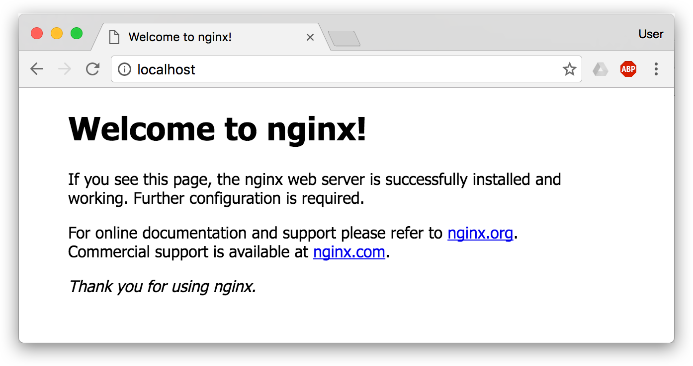
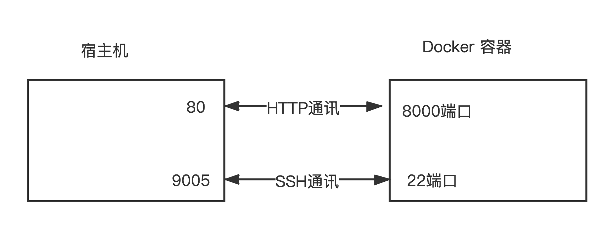
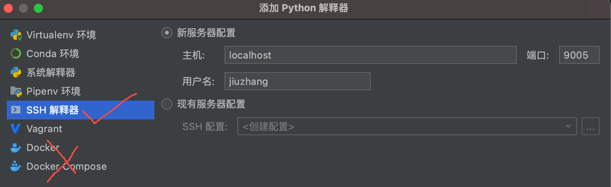
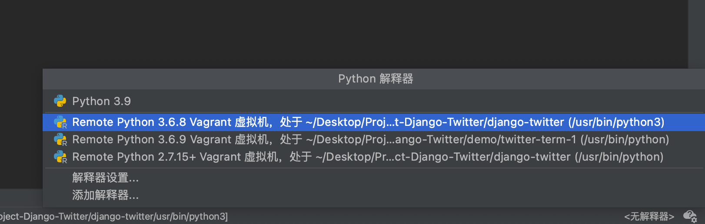
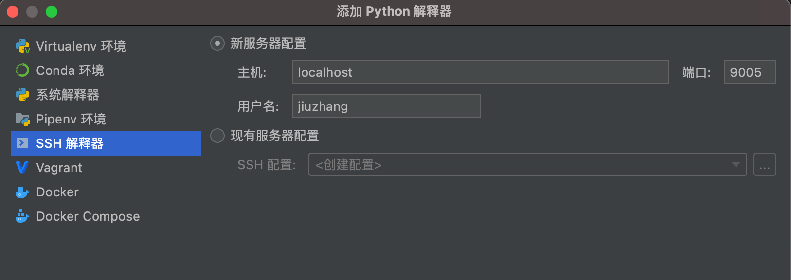
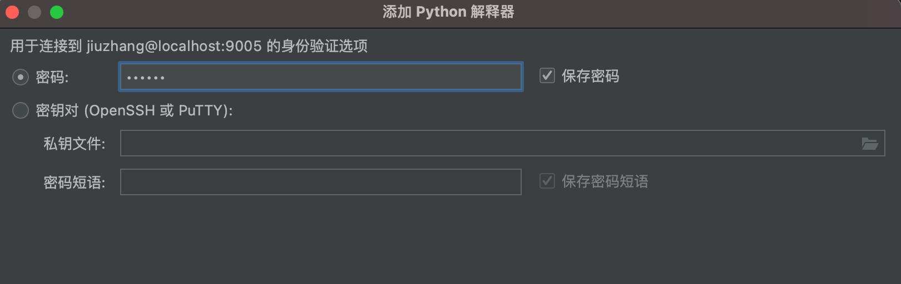
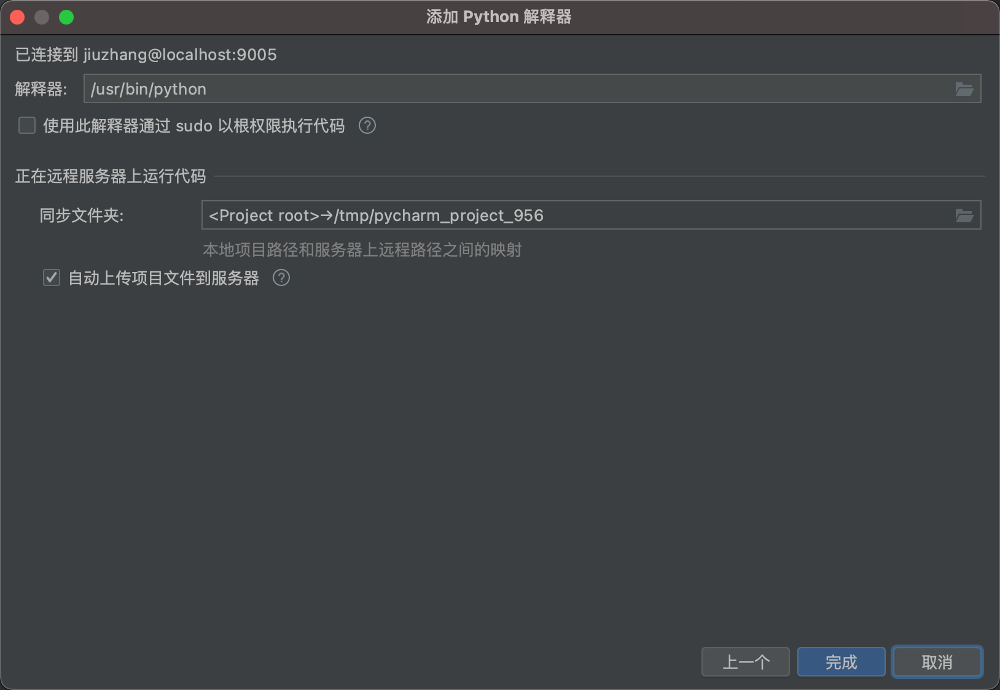

此教程适合如下用户，如不满足，请移步 Vagrant 教程：

- 电脑无法使用虚拟化技术
- 是苹果自研 M1 芯片的 Mac 电脑

完成的内容也在 Vagrant 版本的教材中。

> 本教程只介绍基本的docker安装，更多项目信息请参考 vagrant 教程

# 容器需求

- 可以 `ssh` 连接
- 包含 `vim`、`git`等基本工具

# 安装和配置 Docker

下面的内容将介绍如何下载安装`Docker`，并且为`Docker`配置镜像

## 2.1 下载并安装 Docker

1. 访问[ Docker 官网](https://link.zhihu.com/?target=https%3A//hub.docker.com/) 了解和下载 `Docker`
5. 安装成功后，在终端中输入 `docker --version`  命令查看 `Docker` 版本会得到下面类似信息：

```bash
> docker --version
Docker version 20.10.5, build 55c4c88
```

如果 `docker version` 都正常的话，可以尝试运行一个 [Nginx 服务器](https://hub.docker.com/_/nginx/)：

输入 `docker run -d -p 80:80 --name webserver nginx` 命令

会看到如下内容：

```bash
➜  ~ docker run -d -p 80:80 --name webserver nginx 
Unable to find image 'nginx:latest' locally
latest: Pulling from library/nginx
33847f680f63: Pull complete 
dbb907d5159d: Pull complete 
8a268f30c42a: Pull complete 
b10cf527a02d: Pull complete 
c90b090c213b: Pull complete 
1f41b2f2bf94: Pull complete 
Digest: sha256:8f335768880da6baf72b70c701002b45f4932acae8d574dedfddaf967fc3ac90
Status: Downloaded newer image for nginx:latest
39261d2d0f03071348332c34dd8fe705564e6291d958d1d17d2f99f7a2efebdb
```

服务运行后，可以访问 [http://localhost](http://localhost/)，如果看到了 "Welcome to nginx!"，就说明 Docker Desktop for Mac 安装成功了。



要停止 Nginx 服务器并删除执行下面的命令：

```bash
docker stop webserver
docker rm webserver
```

命令运行结果如下所示：

```bash
➜  ~ docker stop webserver
webserver
➜  ~ docker rm webserver
webserver
➜  ~ 
```


## 2.2 配置 Docker镜像源（只对国内用户）

国内从 `Docker Hub` 拉取镜像有时会遇到困难，此时可以配置镜像加速器。`（国外用户不需要）`

国内很多云服务商都提供了国内加速器服务，例如：

- 阿里云加速器(点击管理控制台 -> 登录账号(淘宝账号) -> 右侧镜像中心 -> 镜像加速器 -> 复制地址)
- 网易云加速器 https://hub-mirror.c.163.com
- 百度云加速器 https://mirror.baidubce.com

由于镜像服务可能出现宕机，建议同时配置多个镜像。

> 国内各大云服务商（腾讯云、阿里云、百度云）均提供了 Docker 镜像加速服务，建议根据运行 Docker 的云平台选择对应的镜像加速服务。 

我们以 网易云 镜像服务 https://hub-mirror.c.163.com 为例进行介绍。
### Ubuntu 16.04+、Debian 8+、CentOS 7+
目前主流 `Linux` 发行版均已使用 `systemd` 进行服务管理，这里介绍如何在使用 `systemd` 的 `Linux `发行版中配置镜像加速器。
请首先执行以下命令，查看是否在 `docker.service` 文件中配置过镜像地址。

```bash
$ systemctl cat docker | grep '\-\-registry\-mirror'
```

如果该命令有输出，那么请执行 `$ systemctl cat docker` 查看 `ExecStart=` 出现的位置，修改对应的文件内容去掉 `--registry-mirror` 参数及其值，并按接下来的步骤进行配置。
如果以上命令没有任何输出，那么就可以在 `/etc/docker/daemon.json` 中写入如下内容（如果文件不存在请新建该文件）：

```json
{
  "registry-mirrors": [
    "https://hub-mirror.c.163.com",
    "https://mirror.baidubce.com"
  ]
}
```

> 注意，一定要保证该文件符合 `json` 规范，否则 `Docker` 将不能启动。

之后重新启动服务。

```bash
$ sudo systemctl daemon-reload
$ sudo systemctl restart docker
```

### Windows 10

TIPS：如果是在`win10`中，在`2004`版本之前，`docker`都是基于`Hyper-V`，`2004`版本之后默认使用 `WSL 2` 来运行。

> 如果你使用 windows 且还没有安装 WSL2，可以参考 [微软官方的教程](https://docs.microsoft.com/zh-cn/windows/wsl/install-win10) 来配置 WSL2。记得要 WSL2 不是 WSL1

对于使用 `Windows 10` 的用户，在任务栏托盘 `Docker` 图标内右键菜单选择 `Settings`，打开配置窗口后在左侧导航菜单选择 `Docker Engine`，在右侧像下边一样编辑 `json` 文件，之后点击 `Apply & Restart` 保存后 `Docker` 就会重启并应用配置的镜像地址了。

```json
{
  "registry-mirrors": [
    "https://hub-mirror.c.163.com",
    "https://mirror.baidubce.com"
  ]
}
```

> 注意，一定要保证该文件符合 `json` 规范，否则 `Docker` 将不能启动。

之后重新启动服务。

### macOS

对于使用 `macOS` 的用户，在任务栏点击 `Docker Desktop` 应用图标 -> `Perferences`，在左侧导航菜单选择 `Docker Engine`，在右侧像下边一样编辑 `json` 文件。修改完成之后，点击 `Apply & Restart` 按钮，`Docker` 就会重启并应用配置的镜像地址了。

```json
{
  "registry-mirrors": [
    "https://hub-mirror.c.163.com",
    "https://mirror.baidubce.com"
  ]
}
```

> 注意，一定要保证该文件符合 `json` 规范，否则 `Docker` 将不能启动。

之后重新启动服务。

### 检查加速器是否生效

在终端执行 `docker info` 命令，如果从结果中看到了如下内容，说明配置成功。

```bash
Registry Mirrors:
 https://hub-mirror.c.163.com/
```

## 2.3 定制镜像

### 获取 ubuntu 镜像

运行命令

```bash
docker pull ubuntu:18.04
```

就会拉取 [官网 ](https://hub.docker.com/_/ubuntu)上的 `ubuntu18.04` 镜像，这是一个极其精简的镜像，作为我们定制 `ubuntu` 镜像的基础。

使用命令 `docker image ls` 可以查看当前安装的 `Docker` 镜像。

```bash
➜  ~ docker image ls
REPOSITORY   TAG       IMAGE ID       CREATED       SIZE
ubuntu       18.04     39a8cfeef173   9 days ago    63.1MB
nginx        latest    08b152afcfae   13 days ago   133MB
```


### 创建 ubuntu 容器

使用命令 `docker run -v "source_path:dest_path" -i -t --name mineos ubuntu:18.04 bash` 可以创建并运行一个可以使用终端交互的 `Ubuntu` 容器，命令参数解释：


`-v "source_path:dest_path"` 为我们创建宿主机和容器之间的共享文件夹。


如果是在`win10 2004`以及更高版本上使用的话，可以使用类似如下的方式挂载目录：

```bash
docker run -p 80:8000 -p 9005:22 -v "/c/Users/27/Desktop/TwitterProject/django-twitter-docker:/vagrant" -i -t --name mineos ubuntu:18.04 bash
```

> 在 windows ，因为Docker使用的WSL运行，所以源路径，即宿主机的路径不再是`C:\Users\xx`的形式，而是Linux的`/c/Users/xx`形式。
>
> -p 80:8000 指令会将容器的8000端口映射到宿主机的80端口上。
>
> -p 9005:22 指令将宿主机的9005端口映射到虚拟机的22端口上，22 端口是用于ssh连接用的

上面的命令执行后，就会登陆 `Ubuntu` 容器的 `bash` 中，执行命令`cat /etc/issue` 可以查看系统版本，此时按快捷键组合 `ctrl` + `d` 就会退出 ubuntu 容器，此时就会停止容器运行。

一起来动手实践吧！

```bash
> docker run -p 80:8000 -p 9005:22 -v "your-project-path:/vagrant" -i -t --name mineos ubuntu:18.04 bash
root@0391cc3e2d64:/# cat /etc/issue
Ubuntu 18.04.5 LTS \n \l
```

> 这里我们建立了两种端口映射:
>
> 

运行之后你会看到如下的输出：

```bash
➜  twitter-term-1-docker docker run -p 80:8000  -v "your-project-path:/vagrant" -i -t --name mineos ubuntu:18.04 bash
root@a6ef0c93187f:/# 
```

可以看到 `root@a6ef0c93187f`，此时我们已经登陆到了虚拟机中，并且当前是虚拟机的 root 用户


> Docker 常见命令
>
> - 开机 `docker start`
>
> - 登陆 `docker attach  container_nam`
> - 查看所有容器 `docker ps -a`
> - 查看所有镜像 `docker images `

### 登陆容器

#### 安装vim

```bash
apt update
apt install vim
```

#### 更换软件源（国外用户跳过此步骤）

修改原来的镜像 `vim /etc/apt/sources.list`

```shell
deb http://mirrors.aliyun.com/ubuntu/ bionic main restricted universe multiverse
deb http://mirrors.aliyun.com/ubuntu/ bionic-security main restricted universe multiverse
deb http://mirrors.aliyun.com/ubuntu/ bionic-updates main restricted universe multiverse
deb http://mirrors.aliyun.com/ubuntu/ bionic-proposed main restricted universe multiverse
deb http://mirrors.aliyun.com/ubuntu/ bionic-backports main restricted universe multiverse
deb-src http://mirrors.aliyun.com/ubuntu/ bionic main restricted universe multiverse
deb-src http://mirrors.aliyun.com/ubuntu/ bionic-security main restricted universe multiverse
deb-src http://mirrors.aliyun.com/ubuntu/ bionic-updates main restricted universe multiverse
deb-src http://mirrors.aliyun.com/ubuntu/ bionic-proposed main restricted universe multiverse
deb-src http://mirrors.aliyun.com/ubuntu/ bionic-backports main restricted universe multiverse
```

> 注意换行问题

更新

```bash
apt update
```

#### 创建普通用户

安装必要的组件

```bash
apt install python3 python3-pip wget dos2unix sudo lsb-release iproute2
```

输入 `passwd root` 命令修改root用户的密码

```bash
root@6805b104cdc1:/# passwd root
Enter new UNIX password:
Retype new UNIX password:
```

输入 `adduser jiuzhang` 命令创建sudo用户

```bash
root@6805b104cdc1:/vagrant# adduser jiuzhang
Adding user `jiuzhang' ...
Adding new group `jiuzhang' (1000) ...
Adding new user `jiuzhang' (1000) with group `jiuzhang' ...
Creating home directory `/home/jiuzhang' ...
Copying files from `/etc/skel' ...
Enter new UNIX password:
Retype new UNIX password:
passwd: password updated successfully
Changing the user information for jiuzhang
Enter the new value, or press ENTER for the default
        Full Name []:
        Room Number []:
        Work Phone []:
        Home Phone []:
        Other []:
Is the information correct? [Y/n] y

```

并给刚刚创建的用户添加 sudo 权限 `usermod -aG sudo jiuzhang`

```bash
root@6805b104cdc1:/vagrant# usermod -aG sudo jiuzhang
```

输入 `su - username` 命令切换到新创建的用户：

执行命令后输入如下：

```bash
root@a6ef0c93187f:/vagrant# su - jiuzhang
To run a command as administrator (user "root"), use "sudo <command>".
See "man sudo_root" for details.

jiuzhang@a6ef0c93187f:~$ 

```

使用 sudo 命令运行 whoami 命令，可以看到如下的输出，root 代表当前用户有特权

```bash
jiuzhang@a6ef0c93187f:~$ sudo whoami
[sudo] password for jiuzhang: 
root

```

# 手动执行 provision.sh

将`provision.sh`和`requirements.txt`文件拷贝到宿主机的共享路径中。

> 这两个文件从我们提供的官方 repo 复制就好了：https://github.com/jiuzhangsuanfa-org/django-twitter

登陆容器的终端，执行如下命令

```bash
cd /vagrant
dos2unix provision.sh
dos2unix requirements.txt
./provision.sh
```

> 使用`dos2unix`命令是为了避免`win`和`unix`的换行符不一致引起`/usr/bin/env: 'bash\r': No such file or directory`问题。

添加环境变量

```bash
echo 'export PATH="/home/jiuzhang/.local/bin:$PATH"' >> ~/.bashrc
source ~/.bashrc
```

启动Mysql

```bash
sudo service mysql start
```

此时下面的语句还未生效，可以重新执行一次`./provision.sh`

```bash
sudo mysql -u root << EOF
	ALTER USER 'root'@'localhost' IDENTIFIED WITH mysql_native_password BY 'yourpassword';
	flush privileges;
	show databases;
	CREATE DATABASE IF NOT EXISTS twitter;
EOF
```

----------

此时使用Docker搭建开发环境已经完成


# 使用 Pycharm 连接虚拟环境

请注意：这里使用 Pycharm 连接的 Docker 中的 Python 解释器的时候，不可以使用 Docker 选项，而是要使用 SSH 选项。

因为 Pycharm 中的 Docker 选项是针对镜像的，而不是容器。选择 Docker 是创建一个  `pycharm_helpers` 新的镜像，然后 Pycharm 会根据新的镜像创建一个类似 `pycharm_helpers_PY-211.7142.13` 新的容器，而不是使用我们自己创建的容器。


要使用我们自己容器中的镜像的话，需要使用 `SSH 解释器` 选项，下面就让我们来学习如何配置 SSH 解释器吧！



## 配置 ssh

> 当你第一次打开的时候 Pycharm 喜欢给你创建一个虚拟环境，一定要选择 `取消` ，因为毫无必要。

执行 `sudo apt install openssh-server` 命令安装 ssh 

使用vim打开并修改配置文件，找到`PermitRootLogin prohibit-password`这一行，修改为`PermitRootLogin yes`，允许通过ssh远程访问docker

```bash
sudo vim /etc/ssh/sshd_config
```

修改好之后记得使用 `sudo service ssh restart` 命令重启 ssh 服务

```bash
jiuzhang@efe3f856657c:/$ sudo service ssh restart
[sudo] password for jiuzhang: 
 * Restarting OpenBSD Secure Shell server sshd                                                                                                                                                       [ OK ] 
jiuzhang@efe3f856657c:/$ sudo service ssh status 
 * sshd is running

```

此时我们可以物理机上使用 `ssh jiuzhang@localhost -p 9005` 命令登录 Docker 容器了

```bash
➜  twitter-term-1-docker ssh jiuzhang@localhost -p 9005
The authenticity of host '[localhost]:9005 ([::1]:9005)' can't be established.
ECDSA key fingerprint is SHA256:BxmJFtoWPyXX8qW7HkQVrTn825xQIJ8cukPwM7r+zMU.
Are you sure you want to continue connecting (yes/no/[fingerprint])? yes
Warning: Permanently added '[localhost]:9005' (ECDSA) to the list of known hosts.
jiuzhang@localhost's password: 
Welcome to Ubuntu 18.04.5 LTS (GNU/Linux 5.10.25-linuxkit x86_64)

 * Documentation:  https://help.ubuntu.com
 * Management:     https://landscape.canonical.com
 * Support:        https://ubuntu.com/advantage
This system has been minimized by removing packages and content that are
not required on a system that users do not log into.

To restore this content, you can run the 'unminimize' command.
Last login: Thu Aug  5 07:33:25 2021 from 127.0.0.1
jiuzhang@efe3f856657c:~$ 

```

> 因为我们对宿主机的9005 和 容器的22 端口做了映射，所以使用主机使用 `localhost` 即可

`ssh jiuzhang@localhost -p 9005` 也就等价于 Vagrant 教程中的 `vagrant ssh` 命令了


## 配置 pycharm中的ssh连接

步骤一：

先点击右下角的`无解释器`，然后选择`添加解释器`



步骤二：

填写对应的主机和用户名，选择下一步



步骤三：

输入密码，点击下一步



步骤四：

这里不用修改，默认就好，选择完成。




好了，大功告成！🥳🥳🥳🥳🥳🥳🥳🥳🥳🥳🥳🥳🥳🥳🥳🥳🥳🥳🥳🥳🥳🥳🥳🥳🥳🥳
