# å¼€å‘ç¯å¢ƒæ­å»ºä¸é¡¹ç›®åˆå§‹åŒ–

本次项目我们使用的开å‘ç¯å¢ƒæ˜¯ï¼Œ`Vagrant ` + `VirtualBox` + `PyCharm 专业版 ` + `Ubuntu 18.04`。


注æ„：

- pycharm 需è¦é€‰æ‹©ä¸“业版，ä¸ç„¶æ²¡æœ‰ Django 相关的智能补全和è¿è¡Œã€è°ƒè¯•åŠŸèƒ½ï¼Œä¹Ÿæ²¡æœ‰ Vagrant 相关的è¿æ¥é€‰é¡¹

  > 专业版是收费的，但是æ供了30天的å…费试用。购买的è¯ï¼Œä¸ªäººè®¸å¯è¯å·®ä¸å¤šæ˜¯8.9刀一个月ã€89刀一年
  >
  > 购买链æ¥ï¼šhttps://www.jetbrains.com/pycharm/buy/?fromIDE#personal?billing=yearly
  >
  > 如æœæ˜¯å­¦ç”Ÿæˆ–者开æºå¼€å‘者å¯ä»¥ç”³è¯·å…费许å¯è¯ï¼Œæ›´å¤šä¼˜æƒ è¯·å‚考：https://www.jetbrains.com/pycharm/buy/#discounts?billing=yearly

- 截至目å‰2021-08-1， `Virtualbox`å°šä¸æ”¯æŒæ­è½½è‹¹æœè‡ªç ”m1处ç†å™¨çš„ Mac 电脑，如需è¦è¯·ç§»æ­¥`Docker`版本的教程。

- 有些åŒå­¦ä¼šé—®ï¼š

  - 我已ç»æœ‰ä¸€ä¸ª ubuntu18 的机器了，能ä¸èƒ½ç›´æ¥ç”¨é‚£ä¸ªï¼Œä¸ç”¨ vagrant 啊？

    å¯ä»¥ï¼Œä½†æ˜¯æœ€å¥½ä¸è¦ï¼Œå¯ä»¥æŠŠ vagrant 当作一个知识点

  - 能ä¸èƒ½ç›´æ¥åœ¨ç‰©ç†æœºä¸Šåšå¼€å‘？

    ä¸è¡Œï¼Œç»Ÿä¸€å¼€å‘ç¯å¢ƒè€å¸ˆå’ŒåŠ©æ•™æ‰æœ‰å¯èƒ½å›ç­”你的问题。

  - 能ä¸ç”¨ anacondaã€virtualenvæ¥æ›¿ä»£ vagrant啊？

    ä¸è¡Œã€‚vagrant 是虚拟机，anacondaã€virtualenv是虚拟ç¯å¢ƒï¼Œä¸¤è€…完全ä¸æ˜¯ä¸€å›äº‹ï¼Œæ²¡æœ‰å¯æ¯”性。
    
  - 能ä¸èƒ½ç”¨ vscode 替代 pycharm å¼€å‘？
  
    ä¸å»ºè®®ï¼Œå› ä¸º vscode 远比 pycharm å¼±å°ï¼Œä¼šå½±å“学习效æœ
    
  - 能ä¸èƒ½ç”¨ Visual Studio æ¥åšé¡¹ç›®
  
      ä¸æ供教程外的支æŒï¼Œå¦‚æœéœ€è¦é—®é¢˜éœ€è¦è‡ªå·±å‡ è§£å†³ï¼Œæ‰€ä»¥ä¸æ¨è


## å‰æœŸå‡†å¤‡

### 1. 安装 `Virtualbox`

下载地å€: `https://www.virtualbox.org/wiki/Downloads`


打开下载è¿æ¥å，选择适åˆè‡ªå·±æ“作系统的版本。


如æ“作系统为 Windows，我们å¯ä»¥é€‰æ‹© Windows hosts，下载完æˆå会è·å¾—如下图所示的安装包。


åŒå‡»è¿è¡Œè¯¥å®‰è£…包。


全部默认一直点击`下一步`。

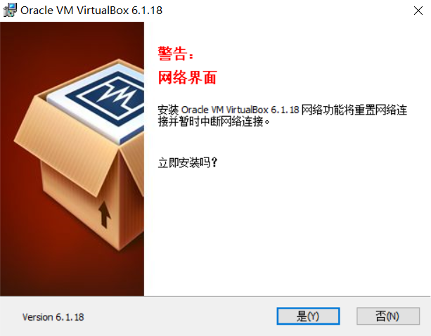

点击`是`，此处`Virtualbox `会为我们安装虚拟网å¡ã€‚


此时便完æˆäº† `Virtualbox ` 安装。


> å…³äºä¸ºä»€ä¹ˆä½¿ç”¨ `Virtualbox `而ä¸æ˜¯ `VMware` ？
>
> ​	因为 `Virtualbox `是开æºå…费的，`VMware`是商业收费的，而且想在 `VMware` 上使用 `Vagrant` 还è¦äºŒæ¬¡æ”¶è´¹ã€‚

### 2. 安装 `Vagrant `

下载地å€ï¼š `https://www.vagrantup.com/downloads`


选择适åˆè‡ªå·±æ“作系统的版本，此处以 `Windows` 为例，点击 `Download` 按钮下载。


下载完æˆå会得到 `vagrant_2.2.14_x86_64.msi` 文件。


åŒå‡»æ‰“开进行安装。


之å一路 `Next` å°±å¯ä»¥äº†ã€‚

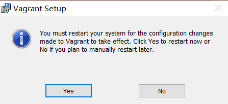

安装完æˆå需è¦`é‡å¯` 计算机。

 

é‡å¯ä¹‹å打开终端，输入 `vagrant --version` ，看到有版本å·è¾“出，就说æ˜å®‰è£…æˆåŠŸäº†ã€‚

```powershell
PS C:\Users\27> vagrant --version
Vagrant 2.2.14
```


> `Vagrant` 并ä¸æ供虚拟化技术，本质上是一个虚拟机外挂，通过虚拟机的管ç†æ¥å£æ¥ç®¡ç†è™šæ‹Ÿæœºï¼Œè®©ç”¨æˆ·æ›´è½»æ¾çš„进行一些常用é…置，比如：CPU/Memory/IP/DISK等分é…。并且æ供了一些其它的管ç†æ“作：比如开机è¿è¡ŒæŒ‡å®šå‘½ä»¤ï¼Œé•œåƒäºŒæ¬¡æ‰“包，æ’件编写等等。


### 3. 创建代ç ä»“库

首先我们打开我们的 github 页é¢ï¼Œç‚¹å‡»å·¦ä¸Šè§’çš„ + ，å†ç‚¹å‡» New repository 按钮创建一个新的仓库。


æ¥ä¸‹æ¥ä¼šè®©ä½ å¡«å†™ä¸€äº›ä¿¡æ¯ï¼Œæ¯”如我们代ç ä»“库的åå­— django-twitter，然å添加一个 `README.md` 文件.


填写完相关信æ¯å，点击 Create repository 按钮，我们就创建了一个代ç ä»“库。


> 注æ„选SSH，而ä¸æ˜¯å·¦è¾¹çš„HTTPS 

### 4.克隆代ç ä»“库

然å我们å¯ä»¥å¤åˆ¶ä¸Šå›¾çº¢æ¡†çš„部分，使用 `git clone` 命令将代ç ä»“库å¤åˆ¶åˆ°æœ¬åœ°ç”µè„‘çš„åˆé€‚ä½ç½®ï¼š

```shell
git clone git@github.com:yourname/django-twitter.git
```

å¦‚æœ clone æˆåŠŸï¼Œå¯ä»¥çœ‹åˆ°å¦‚下图所示æ示，下图的æ“作我们是在宿主机的 Git Bash 上进行æ“作。


此时我们本地的目录结æ„大致为：

```shell
django-twitter
├── .git 
├── .gitignore
└── README.md
```

> 这里 `.git` 是一个éšè—文件夹，如æœä½ åœ¨æ–‡ä»¶ç®¡ç†å™¨ä¸­çœ‹ä¸è§è¿™ä¸ªæ–‡ä»¶å¤¹ï¼Œéœ€è¦æ‰“开文件管ç†å™¨çš„`查看éšè—文件`选项。
>
> æ¥ä¸‹æ¥çš„项目开å‘都是在自己的仓库进行的。

### 5.é…置公钥（å¯é€‰ï¼‰

> 如æœä½ æ˜¯ç¬¬ä¸€æ¬¡ä½¿ç”¨ git ，以å‰æ²¡æœ‰åœ¨è¯¥ç”µè„‘上添加过公钥，那这步是必须的。

如æœä½ åœ¨ä½¿ç”¨ä½¿ç”¨Git 克隆项目的时候é‡åˆ°ä¸‹é¢çš„问题，就需è¦é…置以下公钥了。

```bash
git clone git@github.com:jiuzhangsuanfa/twitter-term-1.git
Cloning into 'twitter-term-1'...
The authenticity of host 'github.com (192.30.255.112)' can't be established.
RSA key fingerprint is SHA256:nThbg6kXUpJWGl7E1IGOCspRomTxdCARLviKw6E5SY8.
Are you sure you want to continue connecting (yes/no/[fingerprint])? yes
Warning: Permanently added 'github.com,192.30.255.112' (RSA) to the list of known hosts.
git@github.com: Permission denied (publickey).
fatal: Could not read from remote repository.

Please make sure you have the correct access rights
and the repository exists.
```

或者这样也需è¦é…置公钥，跟ç€ä¸‹é¢çš„内容é…置公钥就好了。

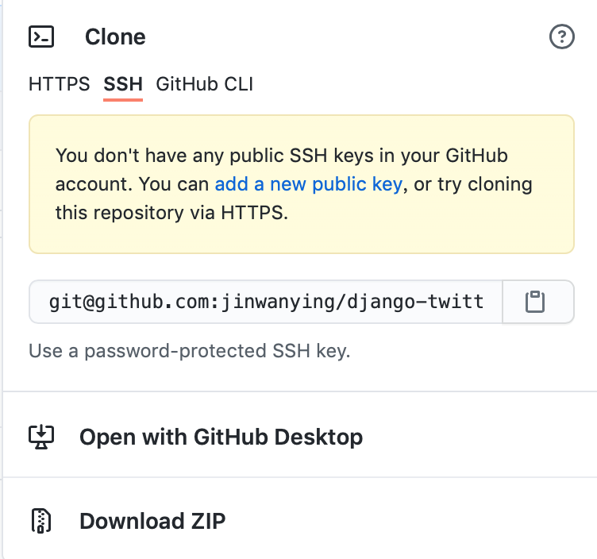


**添加公钥的方法**

- 步骤一：在终端è¿è¡Œä¸‹é¢çš„命令，把邮箱æ¢æˆè‡ªå·±çš„

  ```bash
  ssh-keygen -t rsa -C "email@email.com"
  ```
> 过程中åªéœ€è¦ä¸€è·¯å›è½¦ï¼Œä¸éœ€è¦è¾“入任何内容，默认会在~/.ssh路径下生æˆ`id_rsa` å’Œ`id_rsa.pub`文件。`id_rsa.pub`就是我们需è¦çš„。


  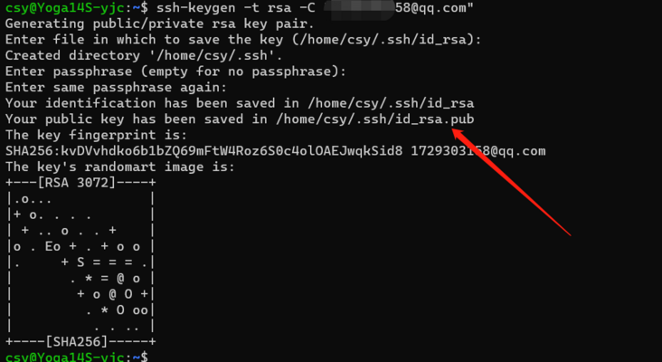

- 步骤二：查看 `~/.ssh`路径下的`id_rsa.pub`文件,并å¤åˆ¶æ–‡ä»¶å†…容

  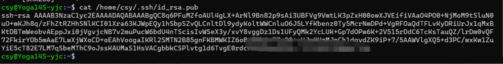

  > 生æˆçš„`id_rsa.pub`一般在`~/.ssh/`目录下。
  >
  > 注æ„：需è¦æŠŠä» **ssh-rsa**开始到**邮箱**的所有内容都å¤åˆ¶

- 步骤三：打开自己的Github主页，选择设置

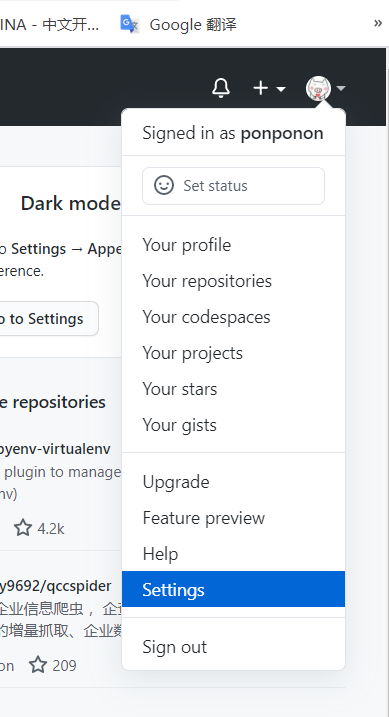

- 步骤四：选择左侧的`SSH and GPG keys`，在选择`New SSH key`


- 步骤五：把刚刚那个公钥å¤åˆ¶åˆ°è¿™é‡Œé¢å°±å¥½äº†ï¼Œtitleéšä¾¿å¡«ï¼Œæ— æ‰€è°“。点击`Add SSH key`ä¿å­˜ã€‚

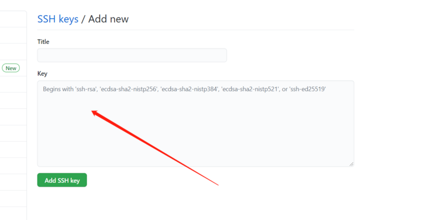

> 注æ„：因为生æˆçš„公钥是æ¥è‡ªæˆ‘们的宿主机，å¯ä»¥é€šè¿‡å®¿ä¸»æœºçš„git程åºcloneã€pull代ç 
>
> 但是如æœæƒ³è¦é€šè¿‡è™šæ‹Ÿæœºæ¥cloneã€pullã€push代ç çš„è¯ï¼Œè¿˜éœ€è¦è®©è™šæ‹Ÿæœºä¹Ÿç”Ÿæˆå…¬é’¥ï¼Œå¹¶æ·»åŠ åˆ°Github中。
>
> 因为虽然宿主机和虚拟机虽然都è¿è¡Œåœ¨åŒä¸€å°ç”µè„‘上，但是是物ç†ä¸Šæ˜¯éš”ç»çš„，都有å„自的git程åºå’Œå¯†é’¥ä½œç”¨èŒƒå›´ã€‚
>
> 但是因为在.git 里é¢ä¼šè®°å½•ä¸€äº›å’Œä¸»æœºç›¸å…³çš„ä¿¡æ¯ï¼Œå› ä¸ºæ˜¯å…±äº«æ–‡ä»¶å¤¹ï¼Œæ‰€ä»¥å†åœ¨è™šæ‹Ÿæœºä¸­æ‰§è¡Œgit指令的时候，有些信æ¯ä¼šå¯¹ä¸ä¸Šå°±ä¼šæŠ¥é”™ï¼Œæ‰€ä»¥å°½é‡åœ¨å®¿ä¸»æœºæœºå™¨ä¸Šæ“作å§ï¼


## 创建虚拟机

> Vagrant是一款用äºæ„建åŠé…置虚拟开å‘ç¯å¢ƒçš„软件，基äºRuby,主è¦ä»¥å‘½ä»¤è¡Œçš„æ–¹å¼è¿è¡Œã€‚
>
> 主è¦ä½¿ç”¨Oracleçš„å¼€æºVirtualBox虚拟化系统，ä¸Chef，Salt，Puppetç­‰ç¯å¢ƒé…置管ç†è½¯ä»¶æ­é…使用， å¯ä»¥å®è¡Œå¿«é€Ÿè™šæ‹Ÿå¼€å‘ç¯å¢ƒçš„æ„建。
>
> 早期以VirtualBox为对象，1.1以å的版本中开始对应VMware等虚拟化软件，包括Amazon EC2之类æœåŠ¡å™¨ç¯å¢ƒçš„对应。

ç›´æ¥åœ¨ VirtualBox 中安装系统è¦ä½¿ç”¨ ISO é•œåƒæ–‡ä»¶ï¼Œåœ¨ Docker 中安装系统è¦ä½¿ç”¨ image 文件，而è¦é€šè¿‡ Vagrant 安装虚拟机便是通过 BOX å°±åƒæ–‡ä»¶ã€‚æ¥ä¸‹æ¥è®©æˆ‘们æ¥é€šè¿‡ Box 文件æ¥å®‰è£…虚拟机å§ï¼


### 1. 准备 Box é•œåƒ

#### a. 下载 Box é•œåƒ 

下载地å€ï¼š`https://app.vagrantup.com/hashicorp/boxes/bionic64`

>  此处下载的 `Ubuntu` ä¸æ˜¯ä» `Ubuntu` 官网下载的 ISO é•œåƒï¼Œè€Œæ˜¯ `Vagrant ` 官网打包好的 `box` é•œåƒï¼Œæˆ‘们的项目使用的æ“作系统为 Ubuntu 18.04 LTS。

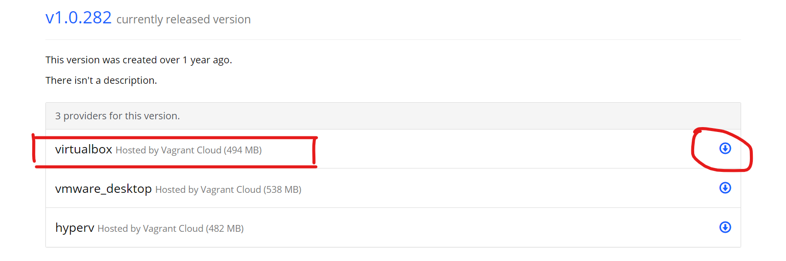

此处我们选择 `virtualbox Hosted by Vagrant Cloud (494 MB)` ，点击å³ä¾§çš„下载按钮便å¯è¿›è¡Œä¸‹è½½ï¼Œä¸‹è½½å®Œæˆåå¯ä»¥å¾—到如下图所示的文件：


ç”±äºé»˜è®¤çš„文件å并ä¸æ˜¯ç‰¹åˆ«å¥½è®°ï¼Œå› æ­¤æˆ‘们å¯ä»¥å°†æ–‡ä»¶å改为 `bionic64.box`，并将其放到我们的 `django-twitter` 下é¢ï¼Œå½“å‰ç›®å½•ç»“æ„如下所示：

```shell
django-twitter
├── .git
├── .gitignore
├── bionic64.box
└── README.md
```

> .git

#### b. 添加 Box é•œåƒ

在当å‰è·¯å¾„下，我们也å¯ä»¥ä½¿ç”¨ Git Bash æ¥è¿è¡Œ Vagrant 的命令，当然你也å¯ä»¥æ˜¯ä½¿ç”¨ä»»æ„你喜欢的终端。


> 注æ„è¦è¿›å…¥åˆ° `django-twitter` 中执行我们的文件。

我们å¯ä»¥ä½¿ç”¨å¦‚下命令将 Box é•œåƒæ·»åŠ åˆ°æˆ‘们的 Vagrant 中：

```shell
vagrant box add hashicorp/bionic64 bionic64.box
```

> `hashicorp/bionic64` 是我们给 Box å–çš„å字，hashicorp æ˜¯å¼€å‘ Vagrant 这个产å“çš„å…¬å¸åå­—
>
> `bionic64.box` 是 Box 文件所在的路径，这里就相当äºæ˜¯ç›¸å¯¹è·¯å¾„。

添加å，我们å¯ä»¥ç”¨ä¸‹é¢çš„命令进行查看：

```shell
vagrant box list
```

看到下图说æ˜æ·»åŠ æˆåŠŸã€‚

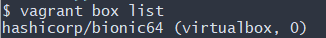


### 2. 虚拟机å¯åŠ¨å‰é…ç½®

> `Vagrantfile`ã€`provision.sh`ã€`requirements.txt `三个文件ä¸éœ€è¦è‡ªå·±ä¿®æ”¹ï¼Œç›´æ¥ä»ä¹ç« ä»“库中è·å–å³å¯ï¼Œä¸‹æ–‡æœ‰ä»‹ç»ï¼Œä¸è¦ç€æ€¥ã€‚

#### a.  Vagrantfile

`Vagrantfile` 文件如下所示：（项目中è¦ç”¨åˆ°`Vagrantfile`é…置文件会在仓库中æ供，届时å¤åˆ¶ç²˜è´´å³å¯ï¼‰

```ruby
# -*- mode: ruby -*-
# vi: set ft=ruby :

# All Vagrant configuration is done below. The "2" in Vagrant.configure
# configures the configuration version (we support older styles for
# backwards compatibility). Please don't change it unless you know what
# you're doing.
Vagrant.configure("2") do |config|
  # The most common configuration options are documented and commented below.
  # For a complete reference, please see the online documentation at
  # https://docs.vagrantup.com.

  # Every Vagrant development environment requires a box. You can search for
  # boxes at https://vagrantcloud.com/search.
  config.vm.box = "hashicorp/bionic64"

  # Disable automatic box update checking. If you disable this, then
  # boxes will only be checked for updates when the user runs
  # `vagrant box outdated`. This is not recommended.
  # config.vm.box_check_update = false

  # Create a forwarded port mapping which allows access to a specific port
  # within the machine from a port on the host machine. In the example below,
  # accessing "localhost:8080" will access port 80 on the guest machine.
  # NOTE: This will enable public access to the opened port
  # config.vm.network "forwarded_port", guest: 80, host: 8080

  # Create a forwarded port mapping which allows access to a specific port
  # within the machine from a port on the host machine and only allow access
  # via 127.0.0.1 to disable public access
  # config.vm.network "forwarded_port", guest: 80, host: 8080, host_ip: "127.0.0.1"

  # Create a private network, which allows host-only access to the machine
  # using a specific IP.
  # config.vm.network "private_network", ip: "192.168.33.10"

  # Create a public network, which generally matched to bridged network.
  # Bridged networks make the machine appear as another physical device on
  # your network.
  # config.vm.network "public_network"

  # Share an additional folder to the guest VM. The first argument is
  # the path on the host to the actual folder. The second argument is
  # the path on the guest to mount the folder. And the optional third
  # argument is a set of non-required options.
  # config.vm.synced_folder "../data", "/vagrant_data"

  # Provider-specific configuration so you can fine-tune various
  # backing providers for Vagrant. These expose provider-specific options.
  # Example for VirtualBox:
  #
  # config.vm.provider "virtualbox" do |vb|
  #   # Display the VirtualBox GUI when booting the machine
  #   vb.gui = true
  #
  #   # Customize the amount of memory on the VM:
  #   vb.memory = "1024"
  # end
  #
  # View the documentation for the provider you are using for more
  # information on available options.

  # Enable provisioning with a shell script. Additional provisioners such as
  # Ansible, Chef, Docker, Puppet and Salt are also available. Please see the
  # documentation for more information about their specific syntax and use.
  # config.vm.provision "shell", inline: <<-SHELL
  #   apt-get update
  #   apt-get install -y apache2
  # SHELL
end
```

我们打开 `Vagrantfile` 文件，对其中的一些é…置进行说æ˜ã€‚

- åŸæ–‡ä»¶ç¬¬15行，这里是我们å‰é¢ç»™è™šæ‹Ÿæœºå–çš„å字：

```ruby
config.vm.box = "hashicorp/bionic64"
```

- åŸæ–‡ä»¶ç¬¬26行，这里给宿主机和虚拟机之间建立了端å£æ˜ å°„：

```ruby
config.vm.network "forwarded_port", guest: 80, host: 8080
```

> å续使用中会使用 `config.vm.network "forwarded_port", guest: 8000, host: 80`，将虚拟机（guest）的8000端å£æ˜ å°„为物ç†æœºçš„80端å£

- åŸæ–‡ä»¶ç¬¬35行，这里为虚拟机指定一个ç§æœ‰ç½‘络 IP：

```ruby
config.vm.network "private_network", ip: "192.168.33.10"
```

- åŸæ–‡ä»¶ç¬¬46行，这里给宿主机和虚拟机之间建立了目录映射，我们项目中默认ä¸ä¿®æ”¹ï¼ŒVagrant 会自动在宿主机的 `django-twitter` 和虚拟机的 `/vagrant` 之间建立映射：

```ruby
# config.vm.synced_folder "../data", "/vagrant_data"
```

- åŸæ–‡ä»¶ç¬¬66行，这里å¯ä»¥è®¾ç½®å¯åŠ¨è™šæ‹Ÿæœºæ—¶ï¼Œè¦æ‰§è¡Œçš„脚本文件：

```ruby
config.vm.provision :shell, path: "provision.sh"
```

> 这些é…置说æ˜åªè¦çœ‹çœ‹å°±å¥½ï¼Œéƒ½æ˜¯ vagrant 自己生æˆï¼Œå®é™…使用中会修改他们，而ä¸æ˜¯ä½¿ç”¨é»˜è®¤é…ç½®

#### b. provision.sh

`provision.sh` 文件如下所示：

```bash
#!/usr/bin/env bash

echo 'Start!'

sudo update-alternatives --install /usr/bin/python python /usr/bin/python3.6 2

cd /vagrant

sudo apt-get update
sudo apt-get install tree

# 安装é…ç½®mysql8
if ! [ -e /vagrant/mysql-apt-config_0.8.15-1_all.deb ]; then
	wget -c https://dev.mysql.com/get/mysql-apt-config_0.8.15-1_all.deb
fi

sudo dpkg -i mysql-apt-config_0.8.15-1_all.deb
sudo DEBIAN_FRONTEND=noninteractivate apt-get install -y mysql-server
sudo apt-get install -y libmysqlclient-dev

if [ ! -f "/usr/bin/pip" ]; then
  sudo apt-get install -y python3-pip
  sudo apt-get install -y python-setuptools
  sudo ln -s /usr/bin/pip3 /usr/bin/pip
else
  echo "pip3 已安装"
fi

# å‡çº§pip，目å‰å­˜åœ¨é—®é¢˜ï¼Œread timed out，看脸，有时候å¯ä»¥ï¼Œä½†å¤§å¤šæ—¶å€™ä¸è¡Œ
# python -m pip install --upgrade pip
# æ¢æºå®Œç¾è§£å†³
# 安装pip所需ä¾èµ–
pip install --upgrade setuptools -i https://pypi.tuna.tsinghua.edu.cn/simple
pip install --ignore-installed wrapt -i https://pypi.tuna.tsinghua.edu.cn/simple
# 安装pip最新版
pip install -U pip -i https://pypi.tuna.tsinghua.edu.cn/simple
# æ ¹æ® requirements.txt 里的记录安装 pip package，确ä¿æ‰€æœ‰ç‰ˆæœ¬ä¹‹é—´çš„兼容性
pip install -r requirements.txt -i https://pypi.tuna.tsinghua.edu.cn/simple


# 设置mysqlçš„root账户的密ç ä¸ºyourpassword
# 创建å为twitterçš„æ•°æ®åº“
sudo mysql -u root << EOF
	ALTER USER 'root'@'localhost' IDENTIFIED WITH mysql_native_password BY 'yourpassword';
	flush privileges;
	show databases;
	CREATE DATABASE IF NOT EXISTS twitter;
EOF
# fi


# 如æœæƒ³ç›´æ¥è¿›å…¥/vagrant路径下
# 请输入vagrant ssh命令进入
# 手动输入
# 输入ls -a
# 输入 vi .bashrc
# 在最下é¢ï¼Œæ·»åŠ cd /vagrant

echo 'All Done!'
```

> 注æ„，这里我们安装并é…置了 Mysql ，添加了一个 root 用户，并且把密ç è®¾ç½®ä¸º `yourpassword`
>
> ä½ å¯ä»¥åœ¨è™šæ‹Ÿæœºçš„终端使用 `mysql -u root -p"your password" ` 登录数æ®åº“

#### c. requirements.txt

`requirements.txt` 文件如下所示：

```
Django==3.1.3
mysqlclient==2.0.3
```


#### d. è·å–é…置文件（必选）

上é¢æ到的é…置文件å¯ä»¥ä»ä¹ç« æ供的阶段性代ç ä»“库中è·å–，本阶段所需的文件å¯ä»¥ä» `1-initial-vagrant` 分支中è·å–。

仓库地å€ï¼šhttps://github.com/jiuzhangsuanfa-org/django-twitter


我们å¯ä»¥å…ˆé€‰ä¸­åˆ†æ”¯ `1-initial-vagrant`  ，然å采用下载å‹ç¼©åŒ…çš„æ–¹å¼å°†æ–‡ä»¶ä¸‹è½½åˆ°æœ¬åœ°ã€‚

æ¥ç€å°†è¿™ä¸ªåˆ†æ”¯ä¸‹çš„文件 (除了 `README.md`) å¤åˆ¶åˆ° `django-twitter` 目录下。（å³æŠŠä¸‹è½½çš„zip中的`.gitignore   `〠`mysql-apt-config_0.8.15-1_all.deb`   ã€`provision.sh`ã€`requirements.txt`å’Œ `Vagrantfile`这五个文件å¤åˆ¶åˆ° `django-twitter` 目录下）

å°†å¤åˆ¶è¿‡æ¥çš„ `Vagrantfile.temp` æ–‡ä»¶æ”¹æˆ `Vagrantfile` 。💥💥💥

> 注æ„国外用户需è¦å»æ‰ `provision.sh` 文件中的 `-i https://pypi.tuna.tsinghua.edu.cn/simple`
>
> 这个是给国内用户准备的清åé•œåƒï¼ŒåŠ é€Ÿå›½å†…用户下载速度的，国外å¯èƒ½é€‚å¾—å…¶å。

示æ„图：

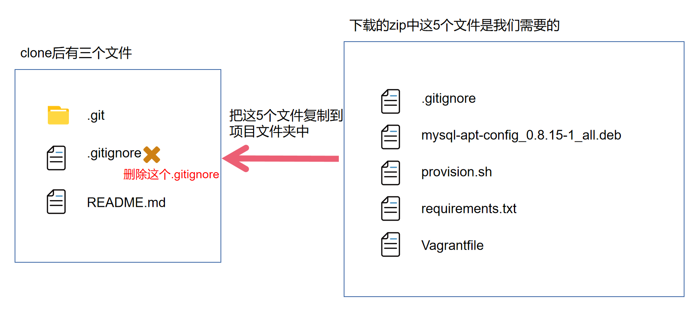

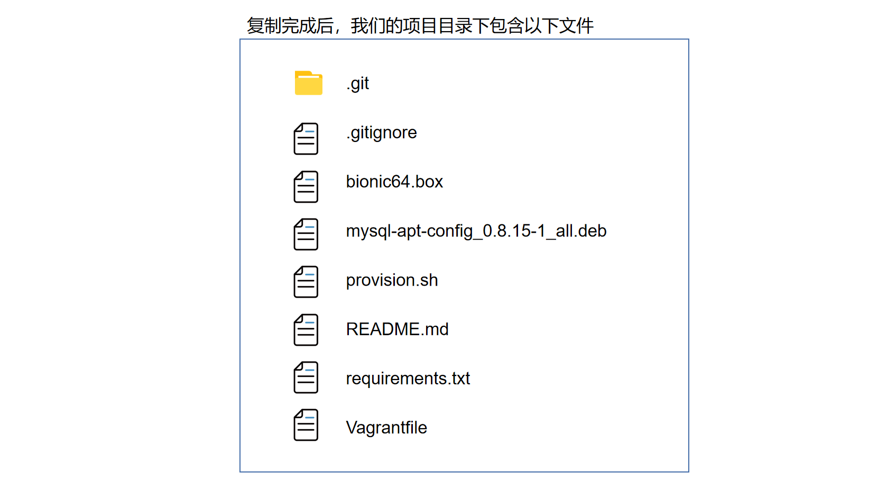

此时的目录结æ„如下所示：

```shell
django-twitter
├── .git
├── .gitignore
├── bionic64.box
├── mysql-apt-config_0.8.15-1_all.deb
├── provision.sh
├── README.md
├── requirements.txt
└── Vagrantfile
```

> 你那里å¯èƒ½ä¼šæœ‰ä¸€ä¸ª `.idea` 的一个éšè—文件夹，忽略它，它是 pycharm 自动生æˆçš„，用äºè®°å½•ä¸€ä¸‹é¡¹ç›®çš„个性化é…置的。
>
> 此处å¯ä»¥ä¿®æ”¹.gitignore追加一行 `.idea/`。 `.idea`文件夹是Pycharmçš„é…置文件

### 3. å¯åŠ¨è™šæ‹Ÿæœº

通过`vagrant up`命令，我们å¯ä»¥å¯åŠ¨è™šæ‹Ÿæœºï¼š

```shell
PS C:\Users\27\Desktop\TwitterProject\django-twitter> vagrant up
Bringing machine 'default' up with 'virtualbox' provider...
==> default: Machine already provisioned. Run `vagrant provision` or use the `--provision`
==> default: flag to force provisioning. Provisioners marked to run always will still run.
.......
```

> 注æ„：在 `Vagrantfile` 文件所在路径执行该命令。因为我们å¯ä»¥åœ¨æœºå™¨ä¸Šè£…很多个虚拟机，执行`vagrant up`命令会首先寻找当å‰è·¯å¾„下的`Vagranfile`文件指å‘的虚拟机。

这个过程å¯èƒ½ä¼šæ¯”较慢，因为在å¯åŠ¨çš„时候会å»æ‰§è¡Œ `provision.sh` 文件，帮我们指定 Python 版本并安装ä¾èµ–，以åŠåˆå§‹åŒ–æ•°æ®åº“。当看到如下界é¢æ—¶ï¼Œè¯´æ˜è™šæ‹Ÿæœºå·²å¯åŠ¨æˆåŠŸã€‚


此时打开  `Virtualbox` å¯ä»¥çœ‹åˆ°ï¼Œæˆ‘们之å‰æ·»åŠ çš„ `ubuntu18` 并且正在è¿è¡Œä¸­ã€‚


> 如æœä½ é‡åˆ°ä¸‹é¢çš„错误：
>
> 
>
> åŸå› å¯èƒ½æ˜¯æ–°ç‰ˆæœ¬çš„ virtualbox 改了，å¯ä»¥é€šè¿‡ä¿®æ”¹ Vagrantfile 中的é…ç½®æ¥è§£å†³ï¼š
>
> 把 `33` 改为 `56`
>
> 
>
> 
>
> ```bash
> Stderr: VBoxManage.exe: error: A NAT rule of this name already exists
> VBoxManage.exe: error: Details: code E_INVALIDARG (0x80070057), component NATEngineWrap, interface INATEngine, callee IUnknown
> VBoxManage.exe: error: Context: "AddRedirect(Bstr(strName).raw(), proto, Bstr(strHostIp).raw(), RTStrToUInt16(strHostPort), Bstr(strGuestIp).raw(), RTStrToUInt16(strGuestPort))" at line 1911 of file VBoxManageModifyVM.cpp
> ```
>
> 如æœä½ åœ¨å¼€æœºè¿‡ç¨‹ä¸­é‡åˆ°å¦‚上👆错误，é‡å¯ä¸€ä¸‹ç”µè„‘å³å¯è§£å†³ã€‚
>
> mac用户的è¯ï¼Œä¹Ÿå¯ä»¥ç”¨å¦‚下命令解决：
>
> ```bash
> sudo "/Library/Application Support/VirtualBox/LaunchDaemons/VirtualBoxStartup.sh" restart
> ```
> 如æœé‡åˆ°å¦‚下错误：
>
> ```bash
> sudo: VirtualBoxStartup.sh: command not found
> ```
>
> å¯ä»¥æ”¹ç”¨ï¼š
>
> ```bash
> cd /Library/Application Support/VirtualBox/LaunchDaemons
> sudo "./VirtualBoxStartup.sh" restart
> ```
>
> 也å¯èƒ½è¿˜ä¼šé‡åˆ°å…¶ä»–问题：
>
> - 如æœæ˜¯ 80 端å£è¢«å ç”¨ï¼Œé‚£å°±æ£€æŸ¥ä¸€ä¸‹è‡ªå·±çš„防ç«å¢™è®¾ç½®ï¼Œæˆ–者有没有其他 server 类的软件å ç”¨äº†è¿™ä¸ªç«¯å£


通过以下命令，我们å¯ä»¥è¿›å…¥åˆ°è™šæ‹Ÿæœºå½“中：

```shell
vagrant ssh
```

进入虚拟机å，我们å¯ä»¥çœ‹åˆ°å¦‚下图所示的界é¢ï¼ˆå¯èƒ½ç•¥æœ‰ä¸åŒï¼‰


然å我们å¯ä»¥ä»¥æ£€æŸ¥ä¸€ä¸‹ Python 的版本是å¦æ­£ç¡®ï¼Œä½¿ç”¨å¦‚下命令：

```shell
python --version
```

Ubuntu 18.04 默认的 Python 版本是 2.7，ç°åœ¨æˆ‘们å¯ä»¥çœ‹åˆ° Python 为 3.6

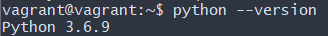

使用以下命令检查 Django 版本：

```shell
python -m django --version
```

å¯ä»¥çœ‹åˆ°æˆ‘们的 Django 版本为 `requirements.txt` 文件中指定的版本


此时让我们了看看 Ubuntu ç¯å¢ƒä¸‹çš„目录结æ„：

```shell
vagrant
├── bionic64.box
├── .git
├── .gitignore 
├── mysql-apt-config_0.8.15-1_all.deb
├── provision.sh
├── README.md
├── requirements.txt
├── .vagrant
│   ├── bundler
│   ├── machines
│   └── rgloader
└── Vagrantfile
```

相比之å‰å¤šäº†ä¸€ä¸ª `.vagrant` 文件夹，这是在 Vagrant å¯åŠ¨å自动生æˆçš„。

> .vagrant 的目录比较å¤æ‚，这里就ä¸å±•å¼€äº†


### 4. 虚拟机å¯åŠ¨åé…ç½®

#### a. å…许远程登入（必选）

通过以下命令打开 `sshd_config` 文件

```shell
sudo vim /etc/ssh/sshd_config
```

将文件中的 `PasswordAuthentication` 选项设置为 `yes` ，并å»æ‰å‰é¢çš„注释。


#### b. 设置高亮显示（å¯é€‰ï¼‰

通过以下命令打开 `.bashrc` 文件

```shell
sudo vim ~/.bashrc
```

将文件中的 `force_color_prompt` 选项设置为 `yes` ，并å»æ‰å‰é¢çš„注释。


#### c. æ›´æ¢è½¯ä»¶æºï¼ˆå›½å¤–用户ä¸é€‰ï¼‰

如æœæ˜¯å›½å†…的用户，å¯ä»¥ä¿®æ”¹ä»¥ä¸‹ `APT` 包管ç†å™¨çš„软件æºï¼Œå¯ä»¥åŠ é€Ÿè½¯ä»¶çš„安装和下载。

- **备份æºåˆ—表**

  Ubuntu é…置的默认æºå¹¶ä¸æ˜¯å›½å†…çš„æœåŠ¡å™¨ï¼Œä¸‹è½½æ›´æ–°è½¯ä»¶éƒ½æ¯”较慢。首先备份æºåˆ—表文件 `sources.list`：

  ```shell
  sudo cp /etc/apt/sources.list /etc/apt/sources.list.backup
  ```

- **修改æºåˆ—表**

  使用以下命令编辑 `sources.list` 文件：

  ```shell
  sudo vim /etc/apt/sources.list
  ```

  打开åçš„ `sources.list` 文件如下所示：

  

  然å我们å¯ä»¥å°†å…¶ä¸­çš„软件æºæ›¿æ¢ä¸ºå›½å†…的软件æºï¼Œæ¯”如下é¢çš„中科大æºï¼š

  ```shell
  deb https://mirrors.ustc.edu.cn/ubuntu/ bionic main restricted universe multiverse
  deb-src https://mirrors.ustc.edu.cn/ubuntu/ bionic main restricted universe multiverse
  deb https://mirrors.ustc.edu.cn/ubuntu/ bionic-updates main restricted universe multiverse
  deb-src https://mirrors.ustc.edu.cn/ubuntu/ bionic-updates main restricted universe multiverse
  deb https://mirrors.ustc.edu.cn/ubuntu/ bionic-backports main restricted universe multiverse
  deb-src https://mirrors.ustc.edu.cn/ubuntu/ bionic-backports main restricted universe multiverse
  deb https://mirrors.ustc.edu.cn/ubuntu/ bionic-security main restricted universe multiverse
  deb-src https://mirrors.ustc.edu.cn/ubuntu/ bionic-security main restricted universe multiverse
  deb https://mirrors.ustc.edu.cn/ubuntu/ bionic-proposed main restricted universe multiverse
  deb-src https://mirrors.ustc.edu.cn/ubuntu/ bionic-proposed main restricted universe multiverse
  ```

编辑完æˆä¹‹å，输入如下命令，更新软件æº

```bash
sudo apt-get update
```


#### d. 修改虚拟机的 `CPU ` æ•°é‡ï¼ˆå¯é€‰ï¼‰

通过 `Vagrant` é…置的虚拟机默认åªç”¨äº†ä¸€ä¸ª `cpu`核心 ，这样性能会比较ä½ï¼Œå¯ä»¥åœ¨  `Virtualbox ` 修改。

在对应虚拟机关机的状æ€ä¸‹ï¼Œé€‰æ‹© `设置` ->  `系统`  -> `处ç†å™¨`  调节处ç†å™¨æ•°é‡ã€‚一般都å¯ä»¥è®¾ç½®4个CPU。

> å¯ä»¥é€šè¿‡ä»¥ä¸‹å‘½ä»¤ï¼Œå…³é—­è™šæ‹Ÿæœºï¼š
>
> ```shell
> sudo shutdown -h now
> ```

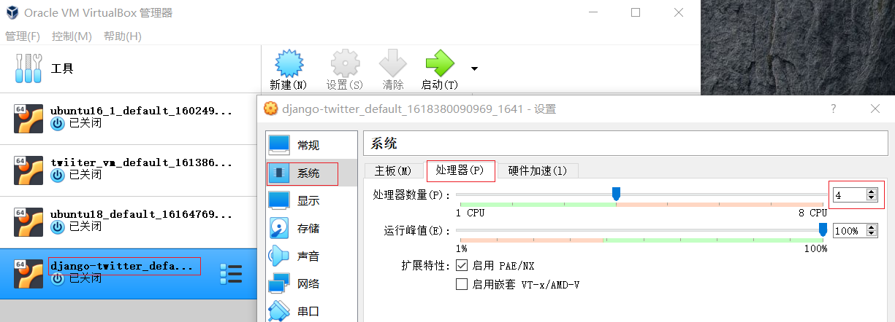


#### d. 远程登录（å¯é€‰ï¼‰

é‡æ–°å¯åŠ¨è™šæ‹Ÿæœºå，å¯ä»¥ä½¿ç”¨ä»»æ„çš„ SSH 终端软件 (MobaXtermã€Termiusã€Xshellã€PuTTYã€SecureCRT) 链æ¥è™šæ‹Ÿæœºï¼Œè™šæ‹Ÿæœºçš„ IP 是我们之å‰è®¾ç½®çš„ç§ç½‘ IP `192.168.33.10`，用户å和密ç é»˜è®¤æ˜¯ `vagrant`。

> 此步骤，å¯ä»¥ç”¨`vagrant ssh` 命令替代，因此是å¯é€‰æ“作。

下é¢ç”¨ MobaXterm æ¥é“¾æ¥æˆ‘们的虚拟机，首先点击 `Session`


然å点击 `SSH`


æ¥ç€è¾“入虚拟节的 IP，点击 OK


最å输入用户å和密ç ï¼Œå³å¯ç™»å…¥æˆåŠŸ


æˆåŠŸåçš„ç•Œé¢å¤§è‡´å¦‚下所示

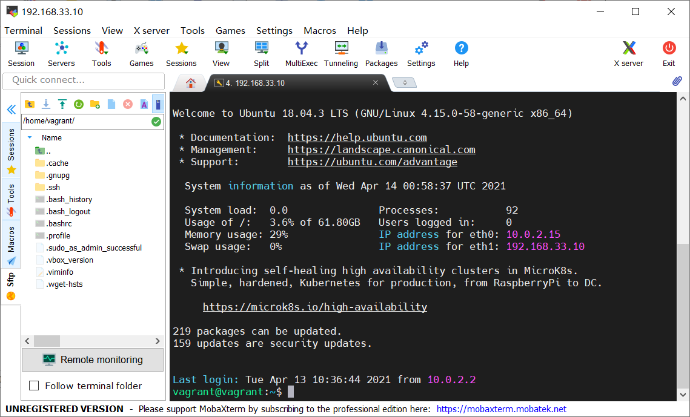

æ¥ç€æˆ‘们å¯ä»¥é€šè¿‡å¦‚下命令进入 `/vagrant` 目录下：

```shell
cd /vagrant
```

å¯ä»¥å‘ç°è™šæ‹Ÿæœºè¿™ä¸ªç›®å½•çš„结æ„和宿主机上的 `django-twitter` 的目录结æ„是一样的。

**虚拟机：**


**宿主机：**


### 5.你需è¦äº†è§£çš„一些细节

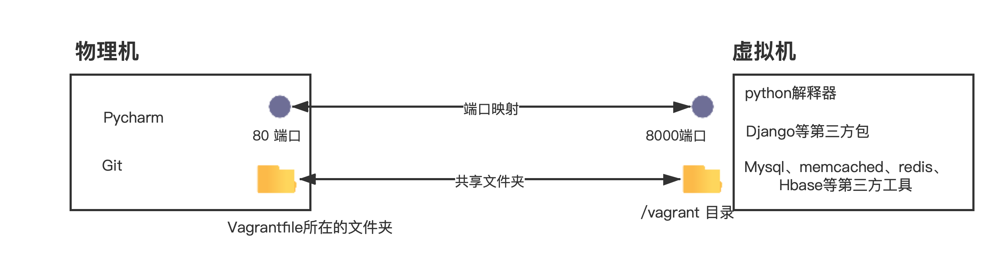


#### å…³äºç«¯å£æ˜ å°„

为了方便我们在物ç†æœºä¸Šè°ƒè¯•ï¼Œå°†ç‰©ç†æœºçš„ 80 端å£æ˜ å°„到虚拟机的 8000 端å£ã€‚

80 端å£æ˜¯ HTTP 端å£

8000 端å£æ˜¯ Django  WSGI SERVER 使用的端å£ï¼Œç”¨äºè¿è¡Œè°ƒè¯•

åšäº†ç«¯å£æ˜ å°„之å，我们就å¯ä»¥åœ¨ç‰©ç†æœºçš„æµè§ˆå™¨è®¿é—® `localhost` å°±å¯ä»¥è®¿é—®è™šæ‹Ÿæœºä¸­çš„ Django æœåŠ¡ï¼Œæœ¬è´¨ä¸Šå°±æ˜¯æŠŠ `localhost` 转æˆäº† `192.168.33.10:8000`


#### å…³äºå…±äº«æ–‡ä»¶å¤¹

通过使用 vagrant，会在物ç†æœºå’Œè™šæ‹Ÿæœºä¹‹é—´å»ºç«‹èµ·ä¸€ä¸ªå…±äº«é€šé“，è¿æ¥æˆ‘们物ç†æœº Vagrantfile 文件所在文件夹和 虚拟机的 /vagrant 文件夹（是/vagrant，ä¸æ˜¯ï½/vagrant哦）

这样我们就å¯ä»¥åœ¨ç‰©ç†æœºä½¿ç”¨ pycharm å¯è§†åŒ–å¼€å‘，而是需è¦åœ¨è™šæ‹Ÿæœºçš„文本命令行界é¢å¼€å‘。而python解释器ã€djangoã€mesql等等工具都是装在虚拟机中的，开å‘ç¯å¢ƒå’Œæˆ‘们的物ç†æœºåšäº†å¾ˆå¥½çš„éš”ç»ã€‚


## æ交代ç 

到目å‰ä¸ºæ­¢ï¼Œæˆ‘们已ç»ç”¨ Vagrant 将开å‘ç¯å¢ƒæ­å»ºå¥½äº†ï¼Œæ¥ä¸‹æ¥æˆ‘们先将这些文件æ交到我们的代ç ä»“库å§ã€‚

> ç¡®ä¿æ­¤æ—¶çš„`.gitignore`文件的开头是这样。åƒä¸‡ä¸è¦æŠŠ`bionic64.box`文件æ交上å»ï¼Œ400多MB太大了。	`.vagrant`文件夹无所谓，æ交也行，ä¸æ交也行。
>
> 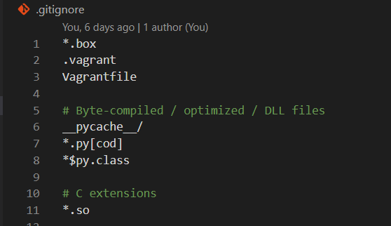

首先我们å¯ä»¥å…ˆç”¨å®¿ä¸»æœºä¸Šçš„ Git Bash 查看一下我们本地代ç ä»“库的状æ€ï¼š

```shell
git status
```

本地仓库的状æ€å¦‚下图所示


å¯ä»¥çœ‹åˆ°å½“å‰æˆ‘们所在的分支是 `main` 分支，并且æ示有四个文件å¯ä»¥æ交。

> 为什么åªæ示四个文件需è¦æ交呢？因为在我们的 `.gitignore ` 文件中规定了哪些文件会被忽略，比如当å‰è·¯å¾„下的 `.vagrant` 文件夹ã€å’Œä»¥ `.box` 结尾的文件等。

我们在åšå¼€å‘æ—¶ä¸ä¼šåœ¨ä¸»åˆ†æ”¯ä¸‹å¼€å‘，所以我们先新建一个分支 `1-initial-vagrant`

```shell
git checkout -b 1-initial-vagrant
```

如下图所示

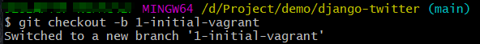

å¯ä»¥çœ‹åˆ°æˆ‘们创建了一个新分支并切æ¢åˆ°äº†æ–°åˆ†æ”¯ä¸Šã€‚然å我们将当å‰è·¯å¾„下的所有文件æ交到暂存区：

```shell
git add .
```

然åå†æ¬¡æŸ¥çœ‹æœ¬åœ°ä»“库的状æ€ï¼Œå¦‚下图所示

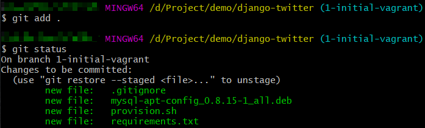

å¯ä»¥çœ‹åˆ°åŸå…ˆçš„四个文件全部都æ交到了暂存区，æ¥ä¸‹æ¥æˆ‘们把文件æ交到本地仓库：

```shell
git commit -m "initial vagrant"
```

如下图所示


å†æ¬¡æŸ¥çœ‹æœ¬åœ°ä»“库时，å‘ç°å·²ç»æ²¡æœ‰æ–‡ä»¶éœ€è¦æ交，æ¥ç€æˆ‘们把本地仓库的更细æ¨é€åˆ°è¿œç¨‹ä»“库，å³æˆ‘们的 GitHub 仓库：

```shell
git push -u origin 1-initial-vagrant
```

如下图所示

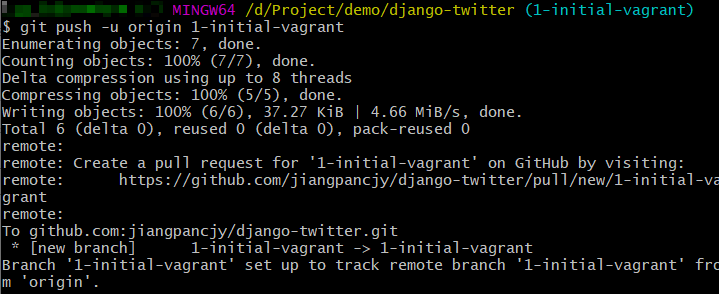

看到上图的信æ¯ï¼Œè¯´æ˜æˆ‘们的代ç æ¨é€æˆåŠŸäº†ã€‚æ¥ç€æˆ‘们æ¥åˆ° github 页é¢æ交一个 pull request (简称 PR)。


点击创建 PR å，我们需è¦å¡«å†™ä¸€ä¸‹ä½ æ交 PR 的目的。

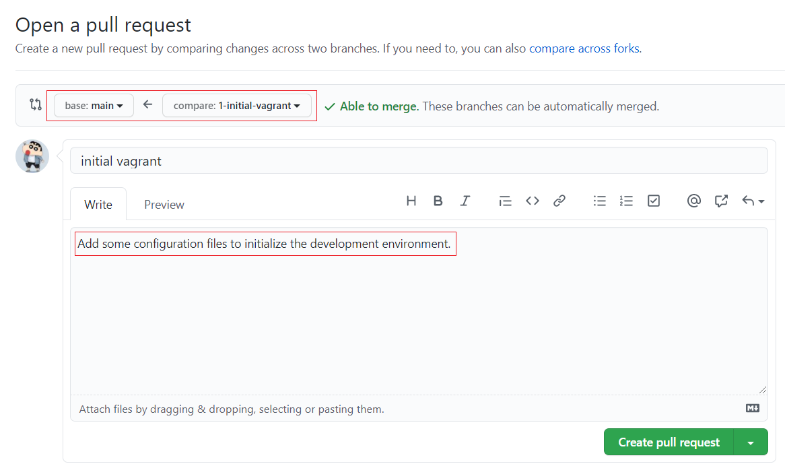

填写完相关的信æ¯å，我们å¯ä»¥ç‚¹å‡»å³ä¸‹è§’çš„ Create pull request。

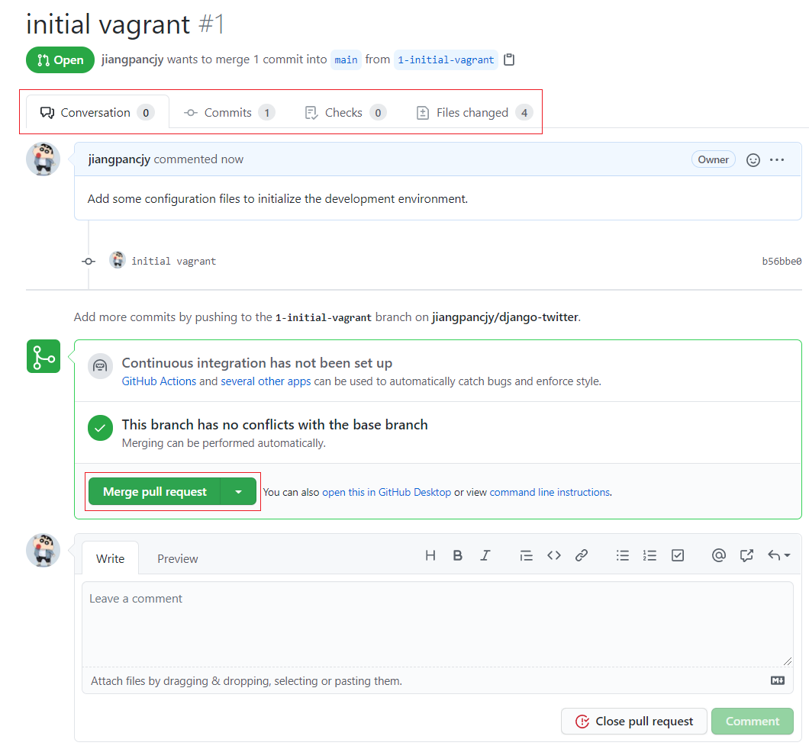

在上图所示的界é¢ä¸­ï¼Œæˆ‘们å¯ä»¥æµè§ˆæˆ‘们æ交的 PR，比如我们点击 Files changes，å¯ä»¥æŸ¥çœ‹æˆ‘们改动的代ç ã€‚


上图所示的æ“作我们通常称之为 review 代ç ï¼Œå½“确认你的代ç æ— è¯¯å，就å¯ä»¥ merge 了。点击 Merge pull request 按钮，你æ交的代ç å°±åˆå¹¶åˆ°äº†ä¸»åˆ†æ”¯å½“中了。

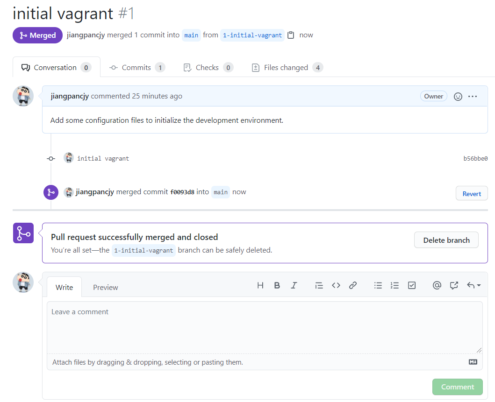


## åˆå§‹åŒ–项目

> æ¥ä¸‹æ¥æˆ‘们会在两个地方执行我们的命令，Git å’Œ Vagrant 的命令我们通常会在 Git Bash 中执行，Django å’Œ Linux 命令我们会在 MobaXterm 中执行。

### 1. 创建项目

æ¥ä¸‹æ¥æˆ‘们è¦å¼€å§‹ä»é›¶å¼€å§‹åˆ›å»ºä¸€ä¸ªé¡¹ç›®äº†ï¼Œåœ¨æ­¤ä¹‹å‰æˆ‘们需è¦åˆ›å»ºä¸€ä¸ªæ–°çš„分支 `2-initial-django` ，使用宿主机上的 Git Bash


然å在 MobaXterm 中使用以下命令在当å‰ç›®å½•ä¸‹åˆ›å»ºä¸€ä¸ªå为 `twitter` 的项目：

```shell
django-admin startproject twitter .
```
> django 安装在 虚拟机中而ä¸æ˜¯ç‰©ç†æœºï¼Œæ‰€ä»¥ï¼Œè¦ä½¿ç”¨ `django-admin` å¿…é¡»è¦åœ¨è™šæ‹Ÿæœºçš„ç¯å¢ƒä¸‹æ‰§è¡Œã€‚
>
> 创建的工程是在`/vagrant`文件夹下，ä¸æ˜¯`/home/vagrant`哦。
>
> ä¸è¦å¿˜è®°åé¢æœ‰ä¸€ä¸ª `.` 点哦。


此时的代ç ç»“æ„为：

```shell
vagrant
├── bionic64.box
├── .git
├── .gitignore
├── manage.py
├── mysql-apt-config_0.8.15-1_all.deb
├── provision.sh
├── README.md
├── requirements.txt
├── twitter
│   ├── asgi.py
│   ├── __init__.py
│   ├── settings.py
│   ├── urls.py
│   └── wsgi.py
├── .vagrant
└── Vagrantfile
```

å¯ä»¥çœ‹åˆ°å¤šäº†ä¸€ä¸ª `twitter` 文件夹和 `manage.py` 文件。

### 2. 修改项目é…置文件

æ¥ä¸‹æ¥æˆ‘们å¯ä»¥ä½¿ç”¨å®¿ä¸»æœºä¸Šçš„ PyCharm 打开 `django-twitter` 目录，并修改 `twitter/settings.py` 文件，


将其 `DATABASES` é…置信æ¯ä¸ºè™šæ‹Ÿæœºä¸Šçš„ MySQL:

```python
DATABASES = {
    'default': {
        'ENGINE': 'django.db.backends.mysql',
        'NAME': 'twitter',
        'HOST': '0.0.0.0',
        'PORT': '3306',
        'USER': 'root',
        'PASSWORD': 'yourpassword',    # 这里是自己下载mysql时候输入两次的那个密ç 
    }
}
```

修改 `ALLOWED_HOST ` é…置信æ¯ï¼š

```python
ALLOWED_HOSTS = ['127.0.0.1', '192.168.33.10', 'localhost']
```


### 3. 执行数æ®è¿ç§»

通过以下命令执行数æ®è¿ç§»

```shell
python manage.py migrate
```

> 我们使用的是虚拟机中的 python ，所以该命令è¦åœ¨è™šæ‹Ÿæœºçš„ç¯å¢ƒä¸­æ‰§è¡Œ

看到如下结æœï¼Œè¯´æ˜æ‰§è¡ŒæˆåŠŸ

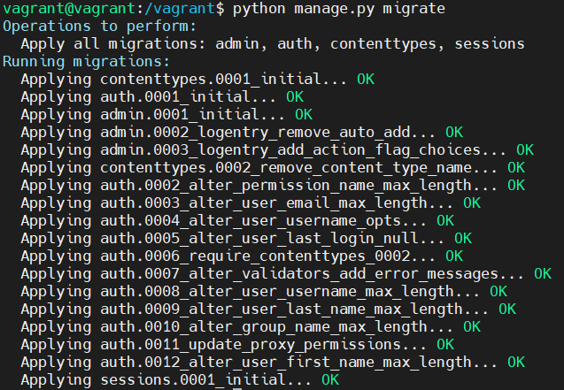

> 如æœåœ¨æ•°æ®è¿ç§»è¿‡ç¨‹ä¸­å‡ºç°`django.db.utils.OperationalError: (1045, "Access denied for user 'root'@'localhost' (using password: YES)")`类似的错误。å¯ä»¥æ£€æŸ¥ä¸€ä¸ªMysql的密ç å’Œé¡¹ç›® `twitter/settings.py`中的设置的数æ®åº“密ç æ˜¯å¦ä¸€è‡´ã€‚
>
> è¿ç§»å®Œæˆä¹‹åä½ å¯ä»¥åœ¨è™šæ‹Ÿæœºçš„终端输入 `mysql -u root -p"yourpassword"` 登录 mysql 查看è¿ç§»å的表å•

### 4. 修改 provision.sh 文件并执行

修改 `provision.sh` 文件，新å¢äº†51~68行的内容：

```bash
#!/usr/bin/env bash

echo 'Start!'

sudo update-alternatives --install /usr/bin/python python /usr/bin/python3.6 2

cd /vagrant

sudo apt-get update
sudo apt-get install tree

# 安装é…ç½®mysql8
if ! [ -e /vagrant/mysql-apt-config_0.8.15-1_all.deb ]; then
	wget -c https://dev.mysql.com/get/mysql-apt-config_0.8.15-1_all.deb
fi

sudo dpkg -i mysql-apt-config_0.8.15-1_all.deb
sudo DEBIAN_FRONTEND=noninteractivate apt-get install -y mysql-server
sudo apt-get install -y libmysqlclient-dev

if [ ! -f "/usr/bin/pip" ]; then
  sudo apt-get install -y python3-pip
  sudo apt-get install -y python-setuptools
  sudo ln -s /usr/bin/pip3 /usr/bin/pip
else
  echo "pip3 已安装"
fi

# å‡çº§pip，目å‰å­˜åœ¨é—®é¢˜ï¼Œread timed out，看脸，有时候å¯ä»¥ï¼Œä½†å¤§å¤šæ—¶å€™ä¸è¡Œ
# python -m pip install --upgrade pip
# æ¢æºå®Œç¾è§£å†³
# 安装pip所需ä¾èµ–
pip install --upgrade setuptools -i https://pypi.tuna.tsinghua.edu.cn/simple
pip install --ignore-installed wrapt -i https://pypi.tuna.tsinghua.edu.cn/simple
# 安装pip最新版
pip install -U pip -i https://pypi.tuna.tsinghua.edu.cn/simple
# æ ¹æ® requirements.txt 里的记录安装 pip package，确ä¿æ‰€æœ‰ç‰ˆæœ¬ä¹‹é—´çš„兼容性
pip install -r requirements.txt -i https://pypi.tuna.tsinghua.edu.cn/simple


# 设置mysqlçš„root账户的密ç ä¸ºyourpassword
# 创建å为twitterçš„æ•°æ®åº“
sudo mysql -u root << EOF
	ALTER USER 'root'@'localhost' IDENTIFIED WITH mysql_native_password BY 'yourpassword';
	flush privileges;
	show databases;
	CREATE DATABASE IF NOT EXISTS twitter;
EOF
# fi

# superuseråå­—
USER="admin"
# superuser密ç 
PASS="admin"
# superuser邮箱
MAIL="admin@twitter.com"
script="
from django.contrib.auth.models import User;
username = '$USER';
password = '$PASS';
email = '$MAIL';
if not User.objects.filter(username=username).exists():
    User.objects.create_superuser(username, email, password);
    print('Superuser created.');
else:
    print('Superuser creation skipped.');
"
printf "$script" | python manage.py shell


# 如æœæƒ³ç›´æ¥è¿›å…¥/vagrant路径下
# 请输入vagrant ssh命令进入
# 手动输入
# 输入ls -a
# 输入 vi .bashrc
# 在最下é¢ï¼Œæ·»åŠ cd /vagrant

echo 'All Done!'
```

注æ„1:

> 此处需è¦æ³¨æ„：项目的 settings.py 中é…置的 Mysql 密ç è¦å’Œæˆ‘们 provision.sh 中é…置的密ç ä¸€æ ·
>
> 比如 provision.sh 脚本通过如下语å¥ï¼š `ALTER USER 'root'@'localhost' IDENTIFIED WITH mysql_native_password BY 'yourpassword';` å°† Mysql的密ç è®¾ä¸º yourpassword，那你è¦ä¿æŒ seetings.py 文件中的 Mysql 密ç ä¹Ÿæ˜¯è¿™ä¸€ä¸ªã€‚
>


注æ„2:
> 如æœå‡ºç° `ERROR 1045 (28000): Access denied for user 'root'@'localhost' (using password: YES)` 这样的错误，是因为你的项目的settings.py 文件中é…置的数æ®åº“密ç å’Œæ•°æ®åº“çš„å®é™…密ç ä¸ä¸€è‡´ï¼Œæ•°æ®åº“ root 默认密ç æ˜¯ yourpassword，å»ä¿®æ”¹ä¸€ä¸‹ `twitter/settings.py` 文件中 `DATABASES` 相关的密ç é€‰é¡¹
>
> TIPS：我们用的是虚拟机中的 Mysql，和物ç†æœºæ²¡å…³ç³»

断开虚拟机è¿æ¥ï¼Œä½¿ç”¨ä¸‹é¢çš„命令é‡æ–°æ‰§è¡Œè„šæœ¬ï¼š

```shell
vagrant provision
```

> Vagrant 是安装物ç†æœºä¸­ï¼Œæ‰€ä»¥è¦æ‰§è¡Œè¿™ä¸ªè™šæ‹Ÿæœºä¸­æ‰§è¡Œè¯¥å‘½ä»¤ã€‚
>
> 但是ä¸è¦å…³é—­è™šæ‹Ÿæœºå“¦ï¼Œæ–­å¼€è™šæ‹Ÿæœºè¿æ¥åªæ˜¯ä¸ºäº†åœ¨ç‰©ç†æœºçš„ç¯å¢ƒä¸‹æ‰§è¡Œå‘½ä»¤ï¼Œä½ ä¹Ÿå¯ä»¥é‡å¼€ä¸€ä¸ªç‰©ç†æœºçš„的终端窗å£ï¼Œæˆ–者在虚拟机的终端中输入 exit 就会å›é€€åˆ°ç‰©ç†æœºçš„终端。

补充一些 provision 知识：

> 因为我们在 `Vagrantfile` 文件中é…置了 `config.vm.provision :shell, path: "provision.sh"`，所以当我们第一次è¿è¡Œ `vagrant up` 命令的时候 ，vagrant 会自动执行 `vagrant provision` 命令跑一边 `provision.sh` 脚本中内容。这åªé™äºç¬¬ä¸€æ¬¡å¼€æœºçš„时候（第一次开机之å‰é¡¹ç›®æ ¹ä¸­æ²¡æœ‰ `.vagrant` 文件夹，开机之å就会生æˆï¼Œæ‰€ä»¥ï¼Œå½“你第 n 次开机想当作第一次开机的è¯ï¼Œå¯ä»¥æŠŠè¿™ä¸ªæ–‡ä»¶å¤¹åˆ æ‰ï¼‰ï¼Œç¬¬äºŒæ¬¡ã€ç¬¬ä¸‰æ¬¡å¼€æœºç­‰ç­‰éƒ½ä¸ä¼šåœ¨è‡ªåŠ¨å»æ‰§è¡Œè¿™ä¸ª  `provision.sh` 脚本，需è¦æ‰‹åŠ¨ä½¿ç”¨ `vagrant provision` 执行哦

### 5. è¿è¡Œé¡¹ç›®

好了，让我们æ¥è¿è¡Œæˆ‘们的项目å§ï¼è®©å®ƒè·‘èµ·æ¥å¯ä»¥è¢«æˆ‘们的æµè§ˆå™¨è®¿é—®åˆ°ã€‚è¿è¡Œé¡¹ç›®ä½¿ç”¨è¿‡ python 调用 manage.py 文件 并é…置相应的 runserver å‚数。

我们å¯ä»¥åœ¨è™šæ‹Ÿæœºçš„终端直æ¥é€šè¿‡å‘½ä»¤æ¥è¿è¡Œé¡¹ç›®ï¼Œä¹Ÿå¯ä»¥åœ¨Pycharm 中通过点按钮的方å¼æ¥è¿è¡Œé¡¹ç›®ã€‚


#### **在虚拟机终端上è¿è¡Œé¡¹ç›®**

我们é‡æ–°è¿æ¥è™šæ‹Ÿæœºï¼Œè¿›å…¥ `/vagrant` 目录，并执行如下命令，è¿è¡Œæˆ‘们的项目：

```shell
python manage.py runserver 0.0.0.0:8000
```

> 我们使用的是虚拟机中的 python ，所以该命令è¦åœ¨è™šæ‹Ÿæœºçš„ç¯å¢ƒä¸­æ‰§è¡Œ

如æœè¿è¡ŒæˆåŠŸï¼Œæˆ‘们å¯ä»¥çœ‹åˆ°å¦‚下画é¢

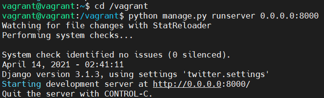

在宿主机的æµè§ˆå™¨ä¸­è¾“å…¥ `localhost`，å¯ä»¥çœ‹åˆ° Django å¯åŠ¨æˆåŠŸçš„ç•Œé¢

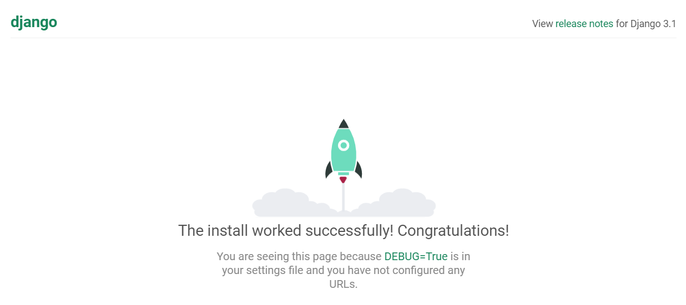


按下 ctrl+c æ¥ç»“æŸ Django æœåŠ¡å§ï¼Œmac下是control+c


#### **在Pycharm上è¿è¡Œé¡¹ç›®**

如æœåœ¨è™šæ‹Ÿæœºçš„终端上输入è¿è¡Œå‘½ä»¤è§‰å¾—太麻烦的è¯ï¼Œå¯ä»¥é€šè¿‡ Pycharm æ¥è¿è¡Œï¼Œï¼ˆPycharm 背å也是通过输入 python manage.py runserver ，但是ä¸éœ€è¦æˆ‘们手动输入了，点一下按钮就行了），我们需è¦åœ¨ PyCharm 上é…置一下 Vagrant çš„ Python 解释器。首先点击“å°æ‰³æ‰‹â€æŒ‰é’®ï¼Œç„¶å在左侧点击 “Python Interpreter†按钮，在å³ä¾§çº¢æ¡†çš„ä½ç½®ç‚¹å‡»â€œå°é½¿è½®â€æŒ‰é’®ï¼Œç„¶å点击“Addâ€ã€‚


然å在左侧选择 Vagrant，å³ä¾§ Vagrant Instance Folder 选择 `django-twitter` 所在的路径，然å点击 “OKâ€ã€‚


> 如æœä½ è¿™é‡Œæ²¡æœ‰ `Vagrant` 选项，å›åˆ°æ•™ç¨‹æœ€å¼€å¤´çœ‹çœ‹è¯´æ˜

然åå†æ¬¡ç‚¹å‡» “OKâ€ï¼Œè§£é‡Šå™¨é…置完毕。

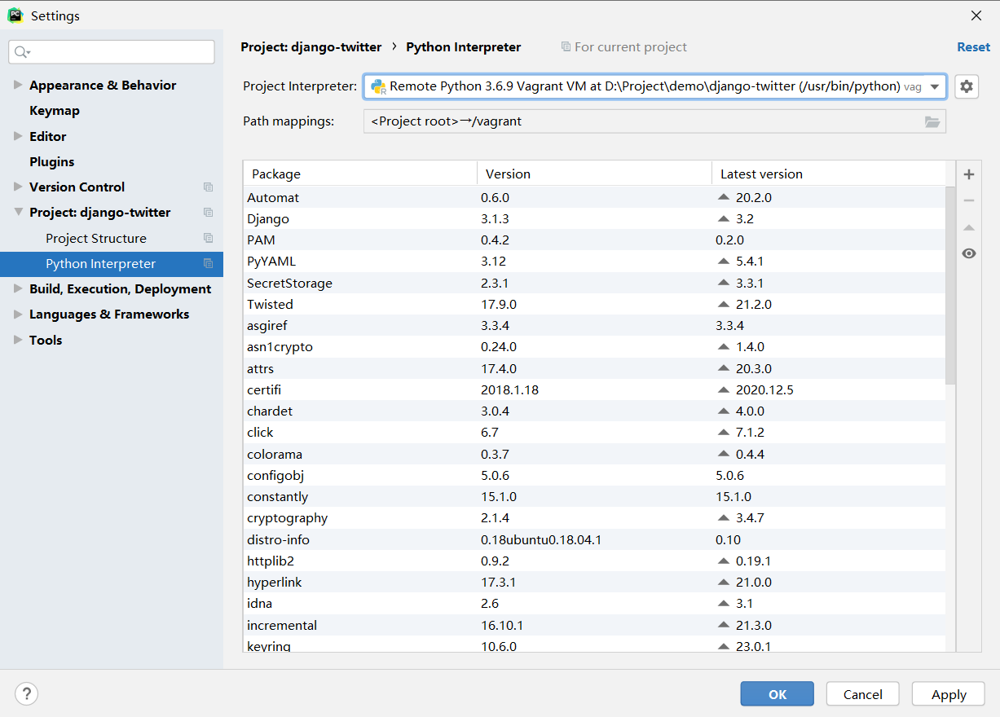

æ¥ç€ PyCharm 会å»å¯¼å…¥è™šæ‹Ÿæœºä¸Šçš„ Python ç¯å¢ƒï¼Œè¿™å¯èƒ½éœ€è¦èŠ±ä¸€æ®µæ—¶é—´ã€‚等导入结æŸå，我们还需è¦å¯¹ Run/Debug 进行é…置，首先点击 “Add Configurationâ€ï¼Œç„¶å点击 + å·ï¼Œé€‰æ‹© “Django Serverâ€ã€‚

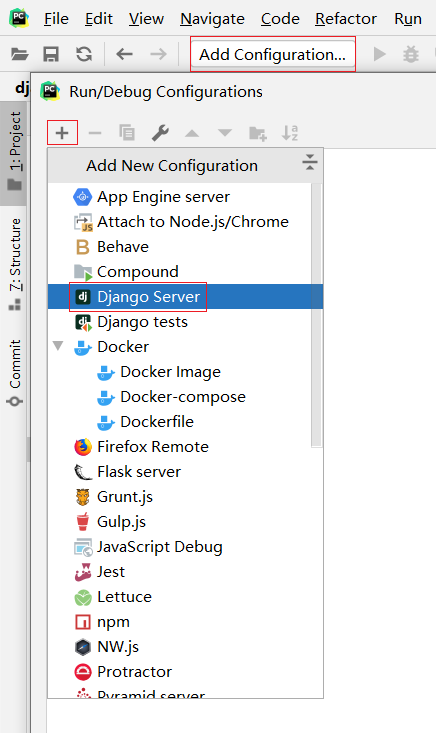

æ¥ç€é…ç½® “Name†和 “Hostâ€ï¼Œç„¶åå¯èƒ½éœ€è¦ä¿®å¤ä¸€ä¸‹ Django ä¾èµ–，点击 “Fixâ€ã€‚

> 这里的 Host 设为 `0.0.0.0` 很é‡è¦ï¼Œåƒä¸‡åˆ«å¿˜äº†ç‚¹åº”用，ä¸ç„¶ä¸ä¼šç”Ÿæ•ˆ


首先勾选 “Enable Django Supportâ€ï¼Œç„¶å指定 Django 的根目录和 `settings.py` 所在的路径，点击 “OKâ€ã€‚

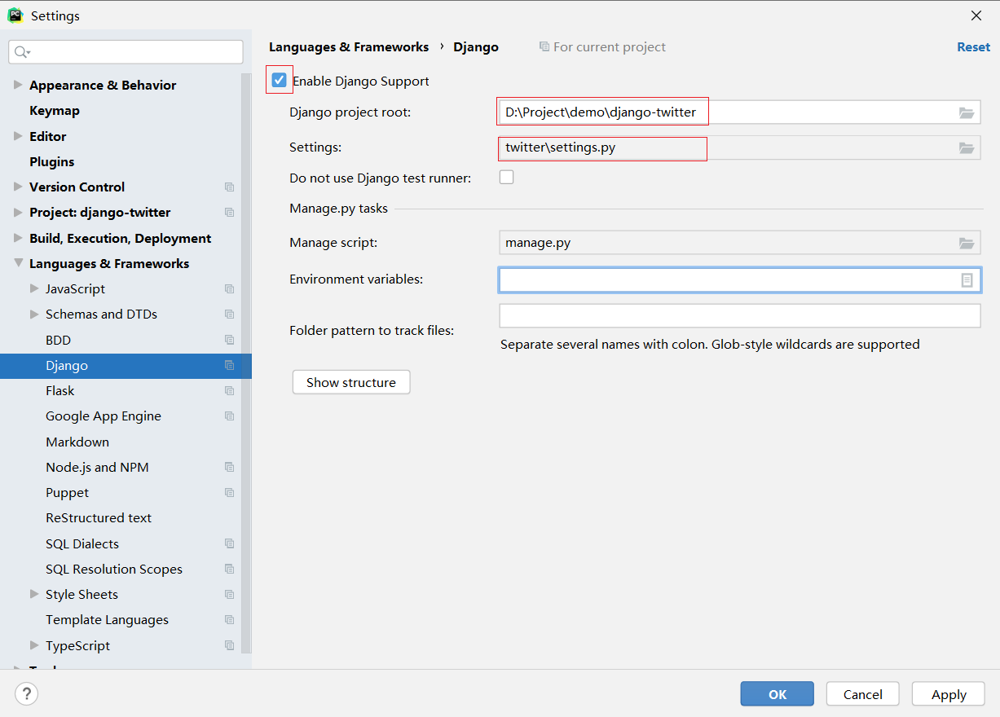

然å我们就å¯ä»¥é€šè¿‡ PyCharm æ¥è¿è¡Œæˆ‘们的项目代ç äº†ï¼Œç‚¹å‡»ç»¿è‰²çš„三角形


如æœä½ çœ‹åˆ°å¦‚下信æ¯ï¼Œå°±è¯´æ˜é¡¹ç›®è¿è¡ŒæˆåŠŸäº†ã€‚


> 注æ„，如æœä½ é‚£é‡Œæ˜¾ç¤ºçš„是 `Starting development server at http://127.0.0.1:8000/`，说æ˜ä½ å‰é¢çš„ HOST 没有设置好

æ¥ç€åœ¨å®¿ä¸»æœºçš„æµè§ˆå™¨ä¸­è¾“å…¥ `localhost`，åŒæ ·å¯ä»¥çœ‹åˆ° Django å¯åŠ¨æˆåŠŸçš„ç•Œé¢


ç°åœ¨åˆå§‹åŒ– Django 项目完æˆäº†ï¼Œæˆ‘们åŒæ ·éœ€è¦æŠŠä»£ç æ›´æ–°åˆ° github 上。

> 如æœæ­¤å¤„ä½ ä¸èƒ½é€šè¿‡æµè§ˆå™¨è®¿é—®ï¼Œæ˜¾ç¤º `ERROR：That port is already in use` ，那说æ˜ä½ æ²¡æœ‰æŠŠä¹‹å‰åœ¨è™šæ‹Ÿæœºç»ˆç«¯ä¸­è·‘èµ·æ¥çš„项目关åœã€‚那个è¿è¡Œç›‘å¬äº† 8000，你åˆåœ¨ pycharm 中å†æ¬¡è¿è¡Œï¼ŒåŒæ ·ç›‘å¬8000 端å£å°±å†²çªäº†ã€‚把åŸæ¥é‚£ä¸ªå…³æ‰å§ï¼ï¼ˆå°±æ˜¯åœ¨å‘½ä»¤è¡Œå¯åŠ¨çš„那个DjangoæœåŠ¡ï¼‰

## æ¥å…¥ Django Rest Framework

### 1. å¢åŠ ä¾èµ–

首先我们需è¦ä¿®æ”¹ `requirements.txt` 文件，å¢åŠ ç¬¬ä¸‰æ–¹åº“ `djangorestframework` 。

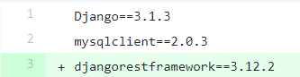

æ¥ä¸‹æ¥æˆ‘们å¯ä»¥å®‰è£… `djangorestframework` ，有如下两ç§æ–¹å¼ï¼š

- **在 PyCharm 中安装**

  当在 `requirements.txt` 文件中新å¢ä¸€ä¸ªä¾èµ–时，PyCharm 会é常智能地æ示你å»å®‰è£…这个ä¾èµ–。

  

  或者在你å»è°ƒç”¨è¿™ä¸ªä¾èµ–时，会æ示你安装

  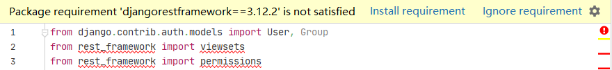

- **在 Vagrant 中安装**

  我们å¯ä»¥åœ¨è™šæ‹Ÿæœºä¸­ç›´æ¥æ‰§è¡Œä»¥ä¸‹å‘½ä»¤å®‰è£…：

  ```shell
  pip install -r requirements.txt
  ```
  
  > 我们使用的是虚拟机中的 pip ，所以该命令è¦åœ¨è™šæ‹Ÿæœºçš„ç¯å¢ƒä¸­æ‰§è¡Œ


  

安装完ä¾èµ–å，我们还需è¦åœ¨ `settings.py` 文件中进行一些修改**（注æ„在开始新的开å‘工作之å‰ï¼Œä¸€å®šè¦åˆ›å»ºæ–°çš„分支，一定è¦åˆ›å»ºæ–°çš„分支，一定è¦åˆ›å»ºæ–°çš„分支ï¼é‡è¦çš„事情说三é）**。


> 一定è¦ç¡®ä¿ `settings.py` 文件中的 `INSTALLED_APPS` 中é…置了 `'rest_framework'` ，å¦åˆ™ä¹‹å访问页é¢æ˜¯ä¼šå‡ºç° `TemplateDoesNotExist` 的错误。


### 2. æ–°å¢ app — accounts

我们å¯ä»¥ä½¿ç”¨ä»¥ä¸‹å‘½ä»¤æ–°å»ºä¸€ä¸ª app：

```shell
python manage.py startapp accounts
```

> 我们使用的是虚拟机中的 python ，所以该命令è¦åœ¨è™šæ‹Ÿæœºçš„ç¯å¢ƒä¸­æ‰§è¡Œ

å¯ä»¥çœ‹åˆ°åœ¨å½“å‰è·¯å¾„下，多了一个 `accounts` 的文件夹。

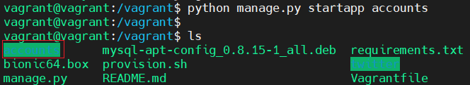

然å我们会在 `accounts` 文件夹下对默认生æˆçš„目录结æ„进行一些改动，首先在 `accounts` 文件夹下新建一个文件夹 `api` ，用äºå­˜æ”¾è§†å›¾ã€åºåˆ—化器等文件。

å¯ä»¥ç”¨å¦‚下命令新建文件夹：

```shell
cd accounts/   # 首先è¦è¿›å…¥ accounts 中
mkdir api
```

å¯ä»¥çœ‹åˆ°åœ¨å½“å‰è·¯å¾„下，多了一个 `api` 文件夹


æ¥ä¸‹æ¥æˆ‘们需è¦ï¼Œå¯¹æˆ‘们的代ç å°±è¡Œä¸€äº›ä¿®æ”¹ï¼Œé¦–先在 `api` 文件下新建一个 `__init__.py` 文件，表示 `api` 文件夹是一个包。

```bash
cd api
> __init__.py
```

> æ³¨æ„ `__init__.py` 是å‰å两个下划线，这个文件里é¢ä¸éœ€è¦æœ‰å†…容，空的就行，但是必ä¸å¯å°‘，没有这个文件，`api`å°±åªæ˜¯ä¸€ä¸ªæ–‡ä»¶å¤¹è€Œä¸æ˜¯ä¸€ä¸ª `Python包`

然å在 `api` 文件下å¢åŠ ä¸€ä¸ªè§†å›¾æ–‡ä»¶ `views.py`:

```python
from django.contrib.auth.models import User, Group
from rest_framework import viewsets
from rest_framework import permissions
from accounts.api.serializers import UserSerializer


class UserViewSet(viewsets.ModelViewSet):
    """
    API endpoint that allows users to be viewed or edited.
    """
    queryset = User.objects.all().order_by('-date_joined')
    serializer_class = UserSerializer
    permission_classes = [permissions.IsAuthenticated]
```

然å在 `api` 文件下å¢åŠ ä¸€ä¸ªåºåˆ—化器文件 `serializers.py` ：

```python
from django.contrib.auth.models import User, Group
from rest_framework import serializers


class UserSerializer(serializers.HyperlinkedModelSerializer):
    class Meta:
        model = User
        fields = ['url', 'username', 'email']
```

最å我们还需è¦ä¿®æ”¹ `twitter/urls.py` 文件：

```python
from django.contrib import admin
from django.urls import include, path
from rest_framework import routers
from accounts.api import views

router = routers.DefaultRouter()
router.register(r'api/users', views.UserViewSet)

urlpatterns = [
    path('admin/', admin.site.urls),
    path('', include(router.urls)),
    path('api-auth/', include('rest_framework.urls', namespace='rest_framework')),
]
```

修改完æˆå，我们å¯ä»¥åœ¨å®¿ä¸»æœºçš„æµè§ˆå™¨ç«¯è®¿é—® `localhost` ，å³å¯ä»¥çœ‹åˆ°å¦‚下界é¢


> 如æœä½ é‡åˆ°äº†å›¾ç‰‡ä¸­çš„问题，大概ç‡ä½ æ²¡æœ‰è®¾ç½® 0.0.0.0 而设置 127.0.0.1
>
> 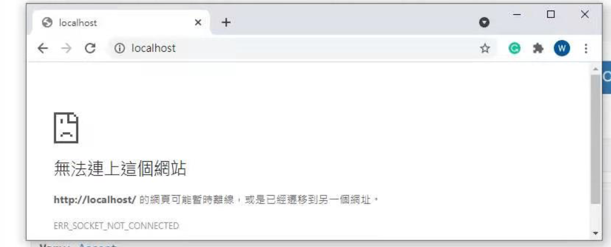


## å®ç°æ³¨å†Œã€ç™»å½•ã€ç™»å‡ºåŠŸèƒ½

æ¥ä¸‹æ¥æˆ‘们è¦å®ç°æ³¨å†Œã€ç™»å½•å’Œç™»å‡ºçš„功能，首先我们先æ¥ä¿®æ”¹ä¸€ä¸‹ `settings.py` 文件：

```python
INSTALLED_APPS = [
    'django.contrib.admin',
    'django.contrib.auth',
    'django.contrib.contenttypes',
    'django.contrib.sessions',
    'django.contrib.messages',
    'django.contrib.staticfiles',
    # third party
    'rest_framework',

    # project apps
    'accounts',
]
```

如上述代ç æ‰€ç¤ºï¼Œæˆ‘们å¢åŠ äº†ä¸€ä¸‹ä»£ç ï¼Œå¹¶å°†ä¹‹å‰åˆ›å»ºçš„应用注册到了 Django 中。

然å我们会修改 `accounts/api/views.py` 中的 `UserViewSet` ：

```python
class UserViewSet(viewsets.ReadOnlyModelViewSet):
    """
    API endpoint that allows users to be viewed or edited.
    """
    queryset = User.objects.all().order_by('-date_joined')
    serializer_class = UserSerializer
    permission_classes = (permissions.IsAuthenticated,)
```

并且修改 `accounts/api/serializers.py` 中的 `UserSerializer` ：

```python
class UserSerializer(serializers.ModelSerializer):
    class Meta:
        model = User
        fields = ('username', 'email')
```

æ¥ä¸‹æ¥è®©æˆ‘们开始写注册ã€ç™»å½•ã€ç™»å‡ºå’ŒæŸ¥çœ‹ç™»å½•çŠ¶æ€çš„æ¥å£ï¼ˆAPI）å§ï¼

首先我们先展示一下 `accounts/api/views.py` 会导入的包：

```python
from accounts.api.serializers import UserSerializer
from django.contrib.auth.models import User
from rest_framework import permissions
from rest_framework import viewsets
from rest_framework.response import Response
from rest_framework.decorators import action
from rest_framework.permissions import AllowAny
from django.contrib.auth import (
    authenticate as django_authenticate,
    login as django_login,
    logout as django_logout,
)
from accounts.api.serializers import SignupSerializer, LoginSerializer
```

ä»¥åŠ `accounts/api/serializers.py` 中导入的包：

```python
from django.contrib.auth.models import User
from rest_framework import serializers, exceptions
```


### 1. 注册

æ¥ç€è®©æˆ‘们æ¥çœ‹çœ‹å¦‚何å®ç°ä¸€ä¸ª**注册**功能，在 `accounts/api/views.py` å¢åŠ å¦‚下代ç ï¼š

```python
class AccountViewSet(viewsets.ViewSet):
    permission_classes = (AllowAny,)
    serializer_class = SignupSerializer
    
		@action(methods=['POST'], detail=False)
    def signup(self, request):
        """
        使用 username, email, password 进行注册
        """
        # ä¸å¤ªä¼˜é›…的写法
        # username = request.data.get('username')
        # if not username:
        #     return Response("username required", status=400)
        # password = request.data.get('password')
        # if not password:
        #     return Response("password required", status=400)
        # if User.objects.filter(username=username).exists():
        #     return Response("password required", status=400)
        serializer = SignupSerializer(data=request.data)
        if not serializer.is_valid():
            return Response({
                'success': False,
                'message': "Please check input",
                'errors': serializer.errors,
            }, status=400)

        user = serializer.save()
        django_login(request, user)
        return Response({
            'success': True,
            'user': UserSerializer(user).data,
        })
```

注册中用到的 `SignupSerializer` 在 `accounts/api/serializers.py` 中：

```python
class SignupSerializer(serializers.ModelSerializer):
    username = serializers.CharField(max_length=20, min_length=6)
    password = serializers.CharField(max_length=20, min_length=6)
    email = serializers.EmailField()

    class Meta:
        model = User
        fields = ('username', 'email', 'password')

    def validate(self, data):
        # TODO<HOMEWORK> å¢åŠ éªŒè¯ username 是ä¸æ˜¯åªç”±ç»™å®šçš„字符集åˆæ„æˆ
        if User.objects.filter(username=data['username'].lower()).exists():
            raise exceptions.ValidationError({
                'message': 'This email address has been occupied.'
            })
        if User.objects.filter(email=data['email'].lower()).exists():
            raise exceptions.ValidationError({
                'message': 'This email address has been occupied.'
            })
        return data

    def create(self, validated_data):
        username = validated_data['username'].lower()
        email = validated_data['email'].lower()
        password = validated_data['password']

        user = User.objects.create_user(
            username=username,
            email=email,
            password=password,
        )
        return user
```


### 2. 登录

æ¥ç€è®©æˆ‘们æ¥çœ‹çœ‹å¦‚何å®ç°ä¸€ä¸ª**登录**功能，在 `accounts/api/views.py`  中的 `AccountViewSet` 视图类下å¢åŠ ä¸€ä¸ª `login` 方法：

```python
    @action(methods=['POST'], detail=False)
    def login(self, request):
        """
        默认的 username 是 admin, password 也是 admin
        """
        serializer = LoginSerializer(data=request.data)
        if not serializer.is_valid():
            return Response({
                "success": False,
                "message": "Please check input",
                "errors": serializer.errors,
            }, status=400)
        username = serializer.validated_data['username']
        password = serializer.validated_data['password']
        user = django_authenticate(username=username, password=password)
        if not user or user.is_anonymous:
            return Response({
                "success": False,
                "message": "username and password does not match",
            }, status=400)
        django_login(request, user)
        return Response({
            "success": True,
            "user": UserSerializer(instance=user).data,
        })
```

登录中用到的 `LoginSerializer` 在 `accounts/api/serializers.py` 中：

```python
class LoginSerializer(serializers.Serializer):
    username = serializers.CharField()
    password = serializers.CharField()
```


### 3. 查看登录状æ€

æ¥ç€è®©æˆ‘们æ¥çœ‹çœ‹å¦‚何å®ç°ä¸€ä¸ª**查看登录状æ€**功能，在 `accounts/api/views.py`  中的 `AccountViewSet` 视图类下å¢åŠ ä¸€ä¸ª `login_status` 方法：

```python
    @action(methods=['GET'], detail=False)
    def login_status(self, request):
        """
        查看用户当å‰çš„登录状æ€å’Œå…·ä½“ä¿¡æ¯
        """
        data = {'has_logged_in': request.user.is_authenticated}
        if request.user.is_authenticated:
            data['user'] = UserSerializer(request.user).data
        return Response(data)
```


### 4. 登出

æ¥ç€è®©æˆ‘们æ¥çœ‹çœ‹å¦‚何å®ç°ä¸€ä¸ª**登出**功能，在 `accounts/api/views.py`  中的 `AccountViewSet` 视图类下å¢åŠ ä¸€ä¸ª `logout` 方法：

```python
    @action(methods=['POST'], detail=False)
    def logout(self, request):
        """
        登出当å‰ç”¨æˆ·
        """
        django_logout(request)
        return Response({"success": True})
```


### 5. 注册路由

修改 `twitter/urls.py` 文件，为我们新写的视图类 `AccountViewSet` 注册路由：

```python
router.register(r'api/accounts', views.AccountViewSet, basename='accounts')
```


到目å‰ä¸ºæ­¢ï¼Œæˆ‘们已ç»å®ç°äº†æ³¨å†Œã€ç™»å½•ã€ç™»å‡ºå’ŒæŸ¥çœ‹ç™»å½•çŠ¶æ€çš„功能，让我们æ¥éªŒè¯ä¸€ä¸‹å§ï¼æ‰“开宿主机上的æµè§ˆå™¨ï¼Œè¾“å…¥ `http://localhost/api/accounts/signup/` æ¥è®¿é—®æ³¨å†Œé¡µé¢ã€‚

> ä¸è¦å¿˜è®° URL 末尾的 `/` 符å·ï¼Œåœ¨ Django 中 url 必须以此结尾，ä¸ç„¶ä¼šå¼•èµ· 301 é‡å®šå‘


> 注æ„，当你在æµè§ˆå™¨ä¸­è¾“å…¥ `http://localhost/api/accounts/signup/` 的时候，是使用 GET 方法（和代ç æ— å…³ï¼Œè¿™æ˜¯æµè§ˆå™¨çš„默认行为），所以会显示 `"detail":"Method \"GET\" not allowed`，这是正确的，注册是一个新建数æ®è®°å½•çš„æ“作，所以需è¦ä½¿ç”¨ POST 方法，而ä¸æ˜¯ GET，想è¦å‘èµ· POST 请求就è¦æŒ‰ POST 按钮


输入 `http://localhost/api/accounts/login/` æ¥è®¿é—®ç™»å½•é¡µé¢ã€‚

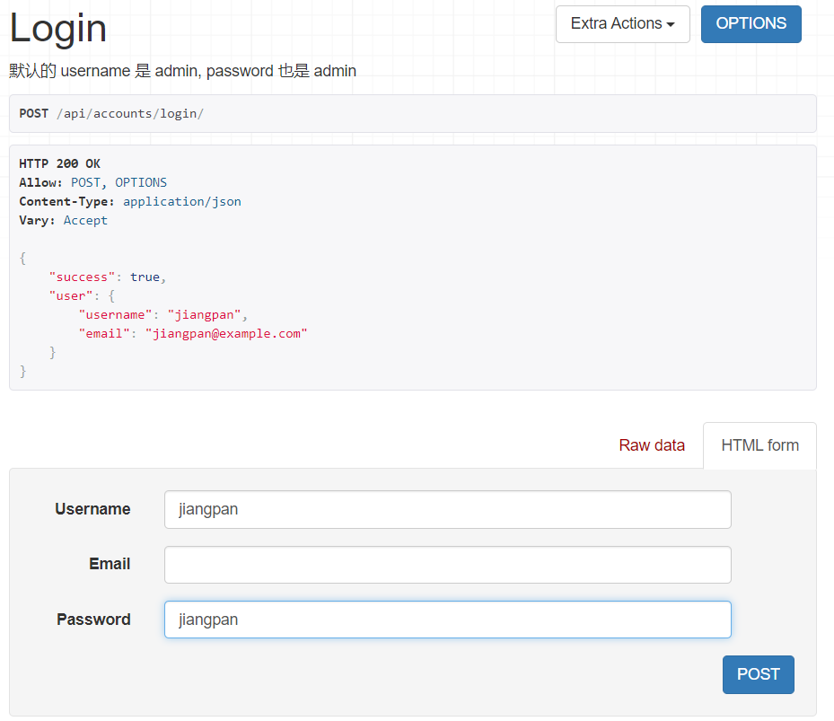

输入 `http://localhost/api/accounts/login_status/` æ¥è®¿é—®æŸ¥çœ‹ç™»å½•çŠ¶æ€é¡µé¢ï¼Œå¯ä»¥çœ‹åˆ°æˆ‘们目å‰æ˜¯æ­£åœ¨ç™»å½•çŠ¶æ€ã€‚


输入 `http://localhost/api/accounts/logout/` æ¥è®¿é—®ç™»å‡ºé¡µé¢ã€‚

> 登出也是一个 POST æ“作，ä¸èƒ½ä½¿ç”¨ GET 方法访问

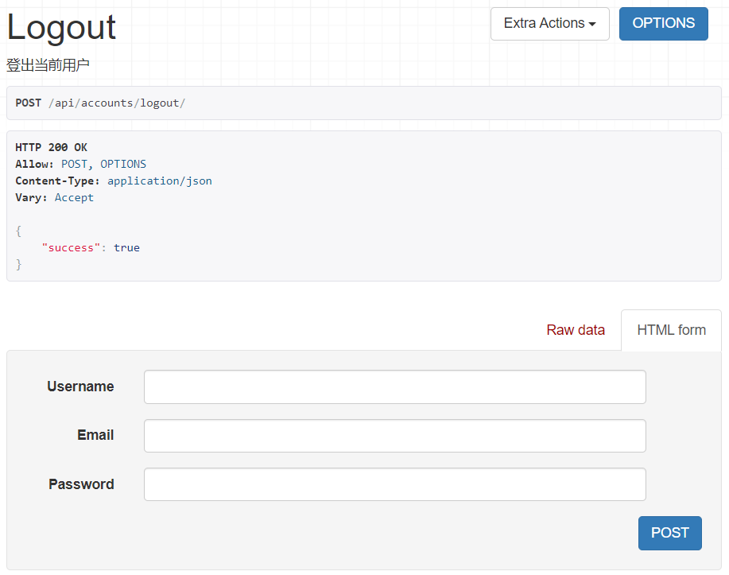

å†æ¬¡è¾“å…¥ `http://localhost/api/accounts/login_status/` æ¥æŸ¥çœ‹ç™»å½•çŠ¶æ€ï¼Œå¯ä»¥çœ‹åˆ°æˆ‘们ç°åœ¨æ˜¯æœªç™»å½•çŠ¶æ€ã€‚

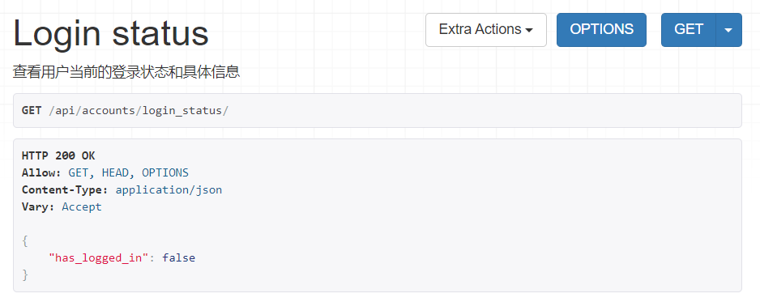


## å•å…ƒæµ‹è¯•

首先在 `accounts/api` 路径下新建一个 `tests.py` 文件，首先先列出写å•å…ƒæµ‹è¯•ä¼šå¯¼å…¥çš„包以åŠå¸¸é‡ (这部分å¯ä»¥å…ˆä¸ç”¨çœ‹ï¼Œåˆ°æ—¶å€™ç”¨åˆ°å†å›æ¥çœ‹å°±è¡Œ)：

```python
from django.test import TestCase
from rest_framework.test import APIClient
from django.contrib.auth.models import User


LOGIN_URL = '/api/accounts/login/'
LOGOUT_URL = '/api/accounts/logout/'
SIGNUP_URL = '/api/accounts/signup/'
LOGIN_STATUS_URL = '/api/accounts/login_status/'
```

然åå†åœ¨ `tests.py` 文件中创建一个å•å…ƒæµ‹è¯•ç±» `AccountApiTests` ，并å®ç°å®ƒç”Ÿæˆæµ‹è¯•æ•°æ®çš„功能：

```python
class AccountApiTests(TestCase):

    def setUp(self):
        # 这个函数会在æ¯ä¸ª test function 执行的时候被执行
        self.client = APIClient()
        self.user = self.createUser(
            username='admin',
            email='admin@jiuzhang.com',
            password='correct password',
        )

    def createUser(self, username, email, password):
        # ä¸èƒ½å†™æˆ User.objects.create()
        # 因为 password 需è¦è¢«åŠ å¯†, username å’Œ email 需è¦è¿›è¡Œä¸€äº› normalize 处ç†
        return User.objects.create_user(username, email, password)
```

æ¥ç€æˆ‘们æ¥å®ç°æµ‹è¯•ç™»å½•çš„功能，在 `AccountApiTests` 类下添加 `test_login` 方法：

```python
    def test_login(self):
        # æ¯ä¸ªæµ‹è¯•å‡½æ•°å¿…须以 test_ 开头，æ‰ä¼šè¢«è‡ªåŠ¨è°ƒç”¨è¿›è¡Œæµ‹è¯•
        # 测试必须用 post 而ä¸æ˜¯ get
        response = self.client.get(LOGIN_URL, {
            'username': self.user.username,
            'password': 'correct password',
        })
        # 登陆失败，http status code è¿”å› 405 = METHOD_NOT_ALLOWED
        self.assertEqual(response.status_code, 405)

        # 用了 post 但是密ç é”™äº†
        response = self.client.post(LOGIN_URL, {
            'username': self.user.username,
            'password': 'wrong password',
        })
        self.assertEqual(response.status_code, 400)

        # 验è¯è¿˜æ²¡æœ‰ç™»å½•
        response = self.client.get(LOGIN_STATUS_URL)
        self.assertEqual(response.data['has_logged_in'], False)
        # 用正确的密ç 
        response = self.client.post(LOGIN_URL, {
            'username': self.user.username,
            'password': 'correct password',
        })
        self.assertEqual(response.status_code, 200)
        self.assertNotEqual(response.data['user'], None)
        self.assertEqual(response.data['user']['email'], 'admin@jiuzhang.com')
        # 验è¯å·²ç»ç™»å½•äº†
        response = self.client.get(LOGIN_STATUS_URL)
        self.assertEqual(response.data['has_logged_in'], True)
```

åŒæ ·æ·»åŠ  `test_logout` 方法æ¥æµ‹è¯•ç™»å‡ºï¼š

```python
    def test_logout(self):
        # 先登录
        self.client.post(LOGIN_URL, {
            'username': self.user.username,
            'password': 'correct password',
        })
        # 验è¯ç”¨æˆ·å·²ç»ç™»å½•
        response = self.client.get(LOGIN_STATUS_URL)
        self.assertEqual(response.data['has_logged_in'], True)

        # 测试必须用 post
        response = self.client.get(LOGOUT_URL)
        self.assertEqual(response.status_code, 405)

        # 改用 post æˆåŠŸ logout
        response = self.client.post(LOGOUT_URL)
        self.assertEqual(response.status_code, 200)
        # 验è¯ç”¨æˆ·å·²ç»ç™»å‡º
        response = self.client.get(LOGIN_STATUS_URL)
        self.assertEqual(response.data['has_logged_in'], False)
```

以åŠæ·»åŠ  `test_signup` 方法æ¥æµ‹è¯•æ³¨å†Œï¼š

```python
 def test_signup(self):
        data = {
            'username': 'someone',
            'email': 'someone@jiuzhang.com',
            'password': 'any password',
        }
        # 测试 get 请求失败
        response = self.client.get(SIGNUP_URL, data)
        self.assertEqual(response.status_code, 405)

        # 测试错误的邮箱
        response = self.client.post(SIGNUP_URL, {
            'username': 'someone',
            'email': 'not a correct email',
            'password': 'any password'
        })
        # print(response.data)
        self.assertEqual(response.status_code, 400)

        # 测试密ç å¤ªçŸ­
        response = self.client.post(SIGNUP_URL, {
            'username': 'someone',
            'email': 'someone@jiuzhang.com',
            'password': '123',
        })
        # print(response.data)
        self.assertEqual(response.status_code, 400)

        # 测试用户å太长
        response = self.client.post(SIGNUP_URL, {
            'username': 'username is tooooooooooooooooo loooooooong',
            'email': 'someone@jiuzhang.com',
            'password': 'any password',
        })
        # print(response.data)
        self.assertEqual(response.status_code, 400)

        # æˆåŠŸæ³¨å†Œ
        response = self.client.post(SIGNUP_URL, data)
        self.assertEqual(response.status_code, 201)
        self.assertEqual(response.data['user']['username'], 'someone')
        # 验è¯ç”¨æˆ·å·²ç»ç™»å…¥
        response = self.client.get(LOGIN_STATUS_URL)
        self.assertEqual(response.data['has_logged_in'], True)
```

å•å…ƒæµ‹è¯•æ·»åŠ å®Œæ¯•ï¼Œè®©æˆ‘们æ¥è¿è¡Œå•å…ƒæµ‹è¯•ï¼Œçœ‹çœ‹æˆ‘们的 API 是å¦èƒ½æ­£å¸¸å·¥ä½œå§ï¼åœ¨è™šæ‹Ÿæœºçš„项目根目录下执行如下命令：

```shell
python manage.py test
```

如下图所示，共执行了三个测试，并全部通过。

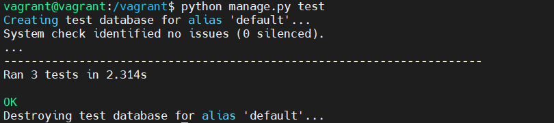


> 如æœæŠ¥ 201错误，å¯ä»¥è§‚察一下`4-user-authentication-api`å’Œ`5-accounts-api-unit-tests`çš„`views.py`文件的区别

本教程已结æŸ


-------------------------


补充一些å†ä¸‹é¢çš„课程中会用到的一些知识点：

# 知识点补充

## å…³äºè¿ç§»æ–‡ä»¶

在教程å‰é¢çš„ åˆå§‹åŒ–项目-执行数æ®è¿ç§» 那一部分，我们执行了 `python manage.py migrate` 命令，除此之外在åé¢çš„教程中还有 `python manage.py makemigrations` 命令。


## å…³äº Mysql 版本问题

在 `provision.sh` 脚本中，我们是希望安装一个 Mysql8 ，但是在一些情况下脚本会执行失败，导致安装了 ubuntu18 apt 仓库中默认的 mysql5.7

å¯ä»¥åœ¨è™šæ‹Ÿæœºçš„终端输入如下命令检查你的 mysql 版本：👇

```bash
mysql --version
```

如æœå®‰è£…了 5.7 ，也ä¸å½±å“æ¥ä¸‹æ¥çš„使用，但是è¦æ³¨æ„一点 ，5.7 的默认字符集是一个字节的拉ä¸æ–‡ï¼Œæ— æ³•å­˜å‚¨ä¸­æ–‡ç­‰å¤šå­—节内容，我们需è¦ä¿®æ”¹ä¸€ä¸‹é»˜è®¤å­—符集为 utf8mb4，在虚拟机的终端输入以下命令：

该命令会修改 `/etc/mysql/mysql.conf.d/mysqld.cnf` é…ç½®æ–‡ä»¶ä¸­å…³äº mysql server 的字符集é…置👇

```bash
echo "character-set-server = utf8mb4" | sudo tee -a /etc/mysql/mysql.conf.d/mysqld.cnf > /dev/null
```

é‡å¯ä¸€ä¸‹ mysql æœåŠ¡å™¨ğŸ‘‡

```bash
sudo service mysql restart
```

好了，此时字符集就å˜æˆ utf8mb4 了

## 更多资料

为大家准备了 `tutorial_pdf/一些有助äºå¼€å‘çš„å®ç”¨å°æŠ€å·§/一些有助äºå¼€å‘çš„å®ç”¨å°æŠ€å·§.md` ，介ç»æ›´å¤šæœ‰åŠ©äºå¼€å‘çš„å®ç”¨å°æŠ€å·§